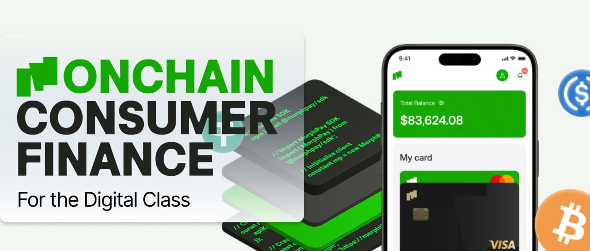

import { CardGroup, Card } from '@site/src/components/Card'

Welcome to Morph, the settlement layer for a global payment network. Morph is also the onchain home of BGB. If you're a developer looking for more information about our technology architecture and how to deploy on Morph, head directly to our technical documentation. If you're here for the first time or want to understand what we're building for the payments ecosystem, then you're in the right place. Follow along this documentation starting here.

### What is Morph?

Morph is evolving into a dedicated payment ecosystem, the settlement layer that transforms stablecoins into everyday currency. Morph is reimagining how value flows onchain, seamless, borderless, and optimized for real-world utility.

We are powering a payment-first infrastructure where over 120 million Bitget and Bitget Wallet users can transact, pay, and access DeFi with native speed and usability.
Our mission is clear: democratize onchain payments and bridge crypto to real-world commerce, unlocking practical utility at internet scale.

### Getting Started

To help you navigate through our resources, here’s a quick guide:

**Introductory Concepts**: 

<CardGroup className="md:grid-cols-2 xl:grid-cols-3">
  <Card
    href="/docs/about-morph/morphs-vision-and-mission"
    icon="/img/cards/users.svg"
    text="Morph's Vision and Mission" />
  <Card 
    href="/docs/about-morph/morphs-architecture"
    icon="/img/cards/research.svg"
    text="Morph's Architecture" />
  <Card
    href="/docs/about-morph/roadmap"
    icon="/img/cards/guide.svg"
    text="Roadmap" />
</CardGroup>

**Step-by-Step Guides**: 

<CardGroup className="md:grid-cols-2 xl:grid-cols-3">
  <Card
    href="/docs/quick-start/wallet-setup"
    icon="/img/cards/wallet.svg"
    text="Wallet Setup" />
  <Card 
    href="/docs/quick-start/wallet-setup"
    icon="./img/cards/faucet.svg"
    text="Faucet" />
  <Card
    href="/docs/quick-start/wallet-setup"
    icon="/img/cards/bridge.svg"
    text="Bridge" />
</CardGroup>

**Links and Tools**: 

<CardGroup className="md:grid-cols-2 xl:grid-cols-3">
  <Card
    href="https://bridge.morphl2.io/"
    icon="./img/cards/bridge.svg"
    text="Morph Bridge" />
  <Card 
    href="https://explorer.morphl2.io/"
    icon="/img/cards/guide.svg"
    text="Morph Explorer" />
  <Card
    href="https://morphfaucet.com"
    icon="/img/cards/faucet.svg"
    text="Morph Faucet" />
</CardGroup>

### Core Product

#### Morph Rails

The programmable infrastructure for developers and merchants. Includes modules for payments, FX, payroll, compliance, and rewards. Permissionless, self-custodial, and scalable. Think of it as a decentralized Stripe.

### Explore and Connect

To get started:
- [**Set up your wallet**](../quick-start/2-wallet-setup.md)
- [**Use the faucet**](../quick-start/3-faucet.md)
- [**Bridge assets**](../quick-start/4-bridge.md)

Join the community and stay up to date:  
𝕏: [x.com/MorphLayer](https://x.com/MorphLayer)  
Discord: [discord.gg/MorphLayer](https://discord.gg/MorphLayer)  
Telegram: [t.me/MorphL2official](https://t.me/MorphL2official)
Morph Builder X: [x.com/MorphDevs](https://x.com/MorphDevs)
