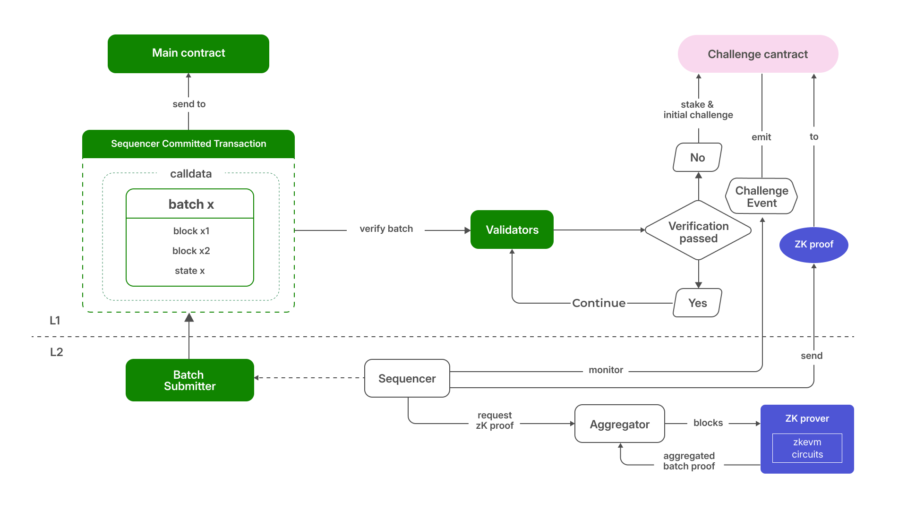
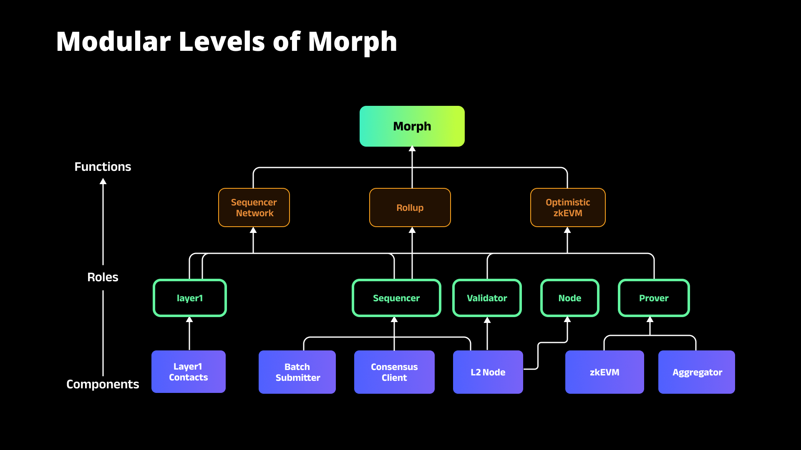

## Decentralized Sequencer Network

Morph's Decentralized Sequencer Network is designed to enhance the security and reliability of the blockchain. Unlike traditional Layer 2 solutions that rely on a centralized sequencer, Morph employs a network of decentralized sequencers. This setup ensures that no single entity has control over the transaction sequencing process, thereby eliminating the risk of a single point of failure. If one sequencer fails or acts maliciously, the others can continue processing transactions, maintaining the system's integrity and uptime. This decentralization also prevents transaction censorship and ensures that no single entity can monopolize Miner Extractable Value (MEV), creating a fairer environment for all users.

This collaborative approach not only increases security but also improves the overall efficiency and reliability of the transaction processing system, making Morph a robust and resilient Layer 2 solution.

Visit Morph’s [Decentralized Sequencer Network](../how-morph-works/decentralized-sequencers/1-morph-decentralized-sequencer-network.md) for a more comprehensive article. 

## Optimistic zkEVM Integration

Optimistic and Zero-Knowledge (ZK) rollups are two distinct approaches to scaling blockchain transactions on layer 2. Optimistic rollups simply assume all transactions are valid when submitting a batch for settlement on Ethereum. However, the validity of any transaction can be contested by entities known as challengers, by submitting proof of fraudulent activity. If the fraud-proof is successful, the incorrect transaction is rejected, ensuring security but at the cost of some potential delays and high gas fees associated with the challenge process.  

ZK rollups, on the other hand, use cryptographic proofs to verify the validity of transactions before these are submitted for settlement. All batches have their own ZK proof, allowing quick verification on the main chain without needing to review all the data associated with each transaction (hence “zero-knowledge”). This offers immediate finality with higher security, but generating these proofs is computationally intensive and costly.  

Morph’s hybrid rollup combines the best of these two approaches. Initially, the system operates optimistically, assuming transactions are valid to allow for quick processing and low costs. When a transaction is contested within Morph’s challenge window, it’s the sequencer that is required to produce a ZK proof to validate the transaction. We call this approach Responsive Validity Proof (RVP). It comes with the following improvements: 

- Efficiency and Speed: A typical 7-day challenge window can be shortened to 1-3 days (a challenger no longer needs the extra time to identify malicious submissions, create a proof, and engage in multiple rounds of challenge procedures).
- Reduced Costs: Employing ZK-proofs means that only minimal transaction information is retained, thereby significantly reducing the cost of L2 submissions. When no challenges arise, the cost of ZK-proof submission and verification can be ignored. RVP is therefore more cost-effective than both optimistic and ZK rollups.        

Visit [Responsive Validity Proof](https://docs.morphl2.io/docs/how-morph-works/optimistic-zkevm) for a more comprehensive article.

## Modular Design

At its core, Morph is constructed using a sophisticated modular design architecture. The platform is organized into three functional modules (Sequencer Network, Rollup, Optimistic zk-EVM), each defined by distinct roles that collaborate in various configurations to meet diverse requirements. Each role within these modules operates its specific components, maintaining functional independence. This modular structure not only fosters flexibility and adaptability but also bolsters the composability of the system. It enables an efficient and interactive ecosystem, supporting the varied operational needs of our platform.

Visit [Morph’s Modular Design](../how-morph-works/2-morph-modular-design.md) for a more comprehensive article. 
