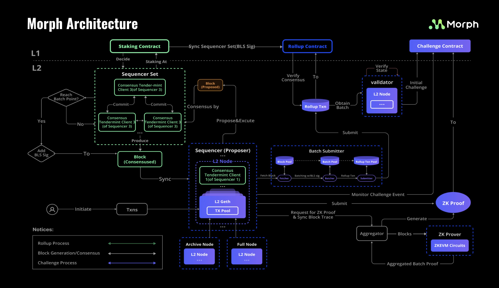

## The Modular Approach

Layer 1 blockchains have traditionally embraced modularity by separating execution, consensus, and data availability. Morph extends this approach across the entire stack, building our platform on the same principle.  

In a typical Layer 1 blockchain, the architecture consists of four major layers:  
- Consensus: The mechanism through which the network reaches agreement.
- Execution: Where transaction processing and smart contract operations occur.
- Settlement: The process of finalizing transactions.
- Data Availability: Ensuring that necessary information is accessible for validation.

## Morph’s Interpretation
Morph Layer reinterprets these layers with unique functionalities:

- **Consensus and Execution via Decentralized Sequencer Network**  
 At Morph, both functions are unified within a decentralized sequencer network. Sequencers coordinate, process, and finalize Morph Layer  transactions. They also act as the main entry point for user interactions.  

- **Settlement with Optimistic zkEVM**  
Settlement in Morph refers to the finalization of Layer 2 transactions at the Ethereum level. It involves validating Layer 2 states. Morph employs the Optimistic zkEVM for this purpose, a hybrid approach blending optimistic rollups and zk-rollups. Layer 2 states are finalized either after a shortened challenge period or, if challenged, through the submission of a corresponding zk-proof.  

- **Data Availability through 'Rollup' Process**:  
This involves transferring essential data to Ethereum. In Morph, this is done through the Rollup process, where a batch submitter compiles blocks into batches and submits them as Layer 1 transactions on Ethereum.  

## Independent yet Collaborative Functions
Each of these major functions operates independently, facilitating asynchronous tasks and switchable implementations:
- Sequencer Network: Executes Layer 2 transactions and updates local state.
- Rollup Module: Transforms Layer 2 blocks into batches for submission to Layer 1.
- State Verification: Utilizes Layer 1 security to verify Layer 2 states under the optimistic zkEVM rules. 

This modular architecture enhances flexibility, adaptability, and composability within the Morph ecosystem.

## Diverse Roles

Morph’s architecture is further defined by five pivotal roles: Sequencers, Validators, Nodes, Provers, and Layer 1 (Ethereum). Each role carries specific responsibilities and uses distinct components to fulfill its function, contributing to the seamless operation of the network.  

For a deeper understanding of Morph’s architecture, please visit our comprehensive [Developer Docs](../build-on-morph/0-developer-navigation-page.md).

## Safety and Security

Security is a top priority at Morph. We are committed to providing users with a safe and trustworthy environment. To achieve this, we have implemented multiple measures, including making our codebase open-source, commissioning third-party audits, and continuously improving our systems to uphold the highest standards of transparency and protection.

### Open-Source Codebase:

Our codebase is publicly available, allowing review and contributions from the community. You can explore it here:
[Morph Contracts](https://github.com/morph-l2/morph/tree/main/contracts)  

### Sherlock Open-Source Audit Report:

We commissioned a full security audit from Sherlock, and the results are publicly available: 
[Sherlock Open-Source Audit Report](https://audits.sherlock.xyz/dashboard/9b78b63a3eb0597e7ba60eec251b6888/confirm_issues)

### Trail of Bits Audit Report:

The Trail of Bits team conducted an in-depth audit of our codebase, including verification of implemented fixes. The complete report is available here [Trail of Bits Audit Report](https://github.com/morph-l2/audits/blob/main/tob/Morph%20-%20Comprehensive%20Report%20with%20Fix%20Review.pdf).   

### Audit Scope:

These audits cover the full codebase, including the bridge contract, ensuring that all critical components have undergone rigorous security assessments.
We believe transparency and security are the foundation of trust. Morph will continue to work with the community and leading security firms to raise standards and provide users with confidence in the platform. For any questions or suggestions, you are welcome to contact us at any time.

