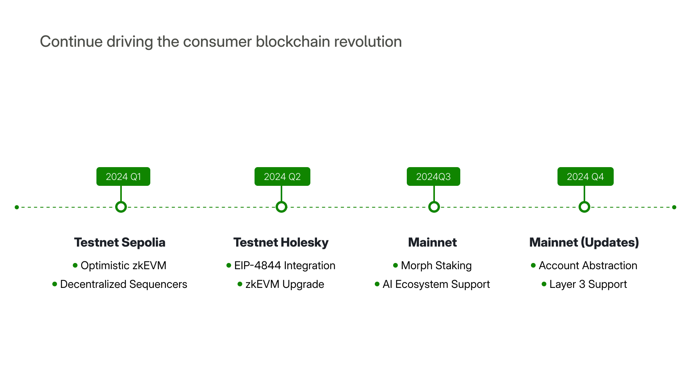

:::tip
 The roadmap is subject to changes based on technological developments, community feedback, and external factors.
:::

## Phase 1: Testnet Beta (2024 Q1)

- EVM Equivalence
- Decentralized Sequencers

## Phase 2: Mainnet Launch (2024 - 2025)

### Mainnet Beta 2024 Q2-3
- Optimistic zkEVM
- AA support
- Intent Centric Interface
  
### Mainnet 2024 Q4 - 2025

- Full Decentralized Stack
- Layer 3 Support
- zkDID & Verifiable Credentials
- Agent Framework
- Complete ZKRollup
  
## Phase 3: Future Stack (2026)

- On-Chain Reality
- Autonomous Governance
- Decentralized - Intelligence Coordination

