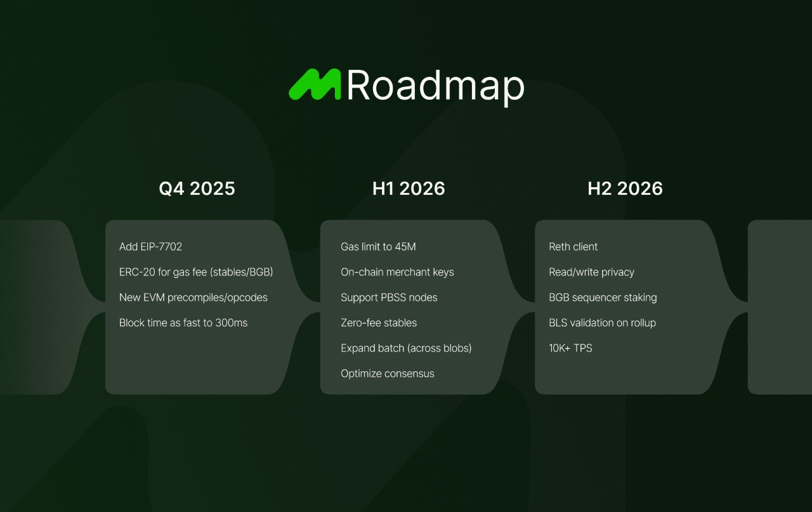

## 2025 Q4: Foundations and Rails

- Enhance EVM compatibility: Add EIP-7702, support ERC-20 for gas fees (stablecoins/BGB), and introduce new EVM precompiles and opcodes.
- Performance improvements: Achieve block times as fast as 300ms.

## 2026 H1: Scaling and Incentives

- Increase scalability: Raise gas limit to 45M and expand batch processing across blobs.
- On-chain merchant solutions: Implement merchant keys and support PBSS nodes.
- Zero-fee stablecoins: Enable zero-fee transfers for stablecoins.
- Consensus optimization: Improve overall system consensus.

## 2026 H2: Privacy, Staking, and Speed

- Privacy enhancements: Implement read/write privacy features.
- Staking and validation: Introduce BGB sequencer staking and BLS validation on rollups.
- Performance boost: Achieve over 10,000 transactions per second (TPS).
- Developer tools: Launch the Reth client for further development and optimizations.
