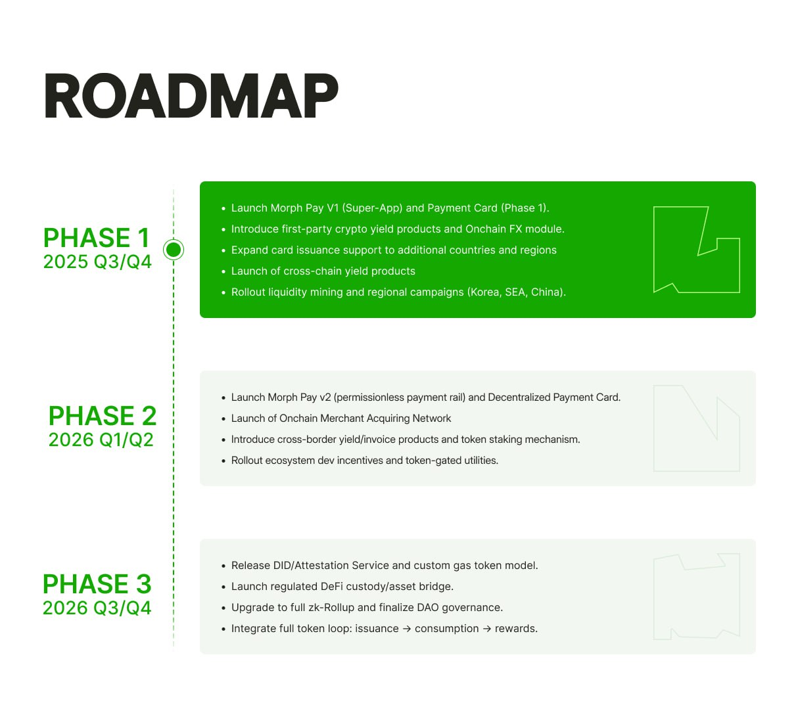

## 2025 Q3

- Launch Morph Payment Card (Phase 1)
- Launch Morph Pay V1 (Super-App)
- Launch first-party crypto yield products (stable return, active management)
- KOL and campaign activations in Korea, SEA, and China

## 2025 Q4

- Enable gasless transactions
- Launch Onchain FX Module with real-time stablecoin swaps
- Expand card issuance support to additional countries and regions
- Launch cross-chain yield products
- Add support for EIP-2537 for batch BLS signature verification
- SDK upgrade with recurring billing and compliance integrations
- Roll out liquidity mining programs across DEX and CEX

## 2026 Q1

- Launch Morph Rails (permissionless, composable payment rail)
- Launch Decentralized Payment Card
- Launch Onchain Merchant Acquiring Network
- Integrate EIP-7702 for sponsored transaction flows
- Roll out Ecosystem Developer Incentive Plan Phase 1

## 2026 Q2

- Launch Morph Token Staking Mechanism
- Launch cross-border invoice and enterprise billing product
- Introduce token-gated ecosystem utilities (compliance API access, priority flow)

## 2026 Q3

- Release DID and Attestation Service
- Enable custom gas token model for ecosystem dApps
- Launch regulated DeFi-aligned custody and asset bridge (internal DeFi-lite infrastructure)

## 2026 Q4

- Upgrade to full zk-Rollup architecture for enhanced scalability and privacy
- Finalize DAO-based governance launch
- Fully integrate first-party service token loop: issuance → consumption → rewards
