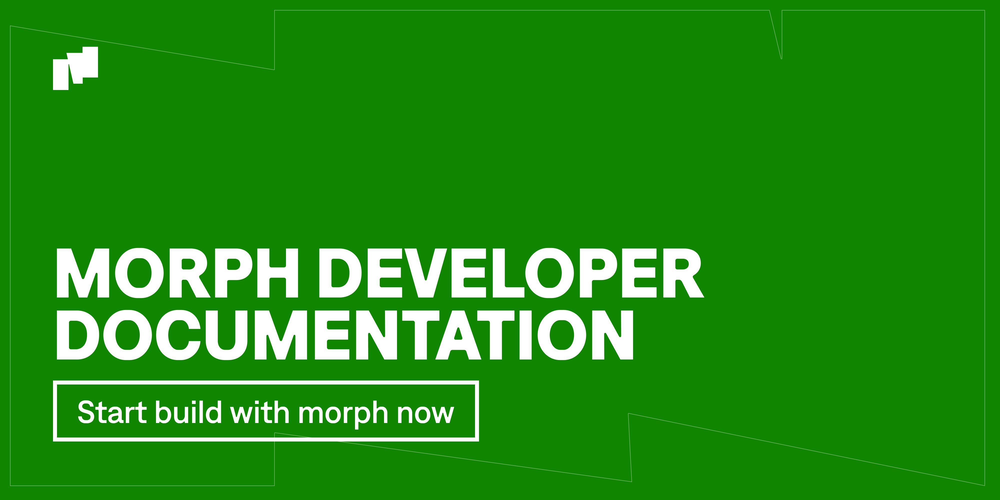

import { CardGroup, Card } from '@site/src/components/Card'

If you’re ready to build applications on Morph, you're in the right place. 

For those who are regular users or visiting for the first time, we recommend starting with our [For Users section](../about-morph/0-user-navigation-page.md) to explore introductory content such as definitions, our vision, key concepts, and more.

### What is Morph?

Morph is the first optimistic zkEVM Ethereum Layer 2 solution that is 100% EVM compatible. Building on Morph is just like building on Ethereum. If you’re experienced in Ethereum development, you'll find your existing code, tooling, and dependencies are fully compatible with Morph.
### Getting Started

To help you get started, here’s a recommended navigation through our documentation:

**Fundamental Concepts**: Start here to learn the core components of Morph, including Morph’s Modular Design, the Decentralized Sequencer Network, and the Responsive Validity Proof system.

<CardGroup className="grid-cols-3">
  <Card
    href="../how-morph-works/decentralized-sequencers/morph-decentralized-sequencer-network"
    icon="/img/cards/research.svg"
    text="Decentralized Sequencers" />
  <Card 
    href="../how-morph-works/optimistic-zkevm"
    icon="/img/cards/research.svg"
    text="Optimistic zkEVM" />
  <Card
    href="../how-morph-works/general-protocol-design/rollup"
    icon="/img/cards/research.svg"
    text="General Protocol Design" />
</CardGroup>

**Developer Guides**: Access comprehensive guides on verifying smart contracts, running a Morph node, deploying contracts, and more.

<CardGroup className="grid-cols-3">
  <Card
    href="../build-on-morph/build-on-morph/development-setup"
    icon="/img/cards/dev.svg"
    text="Development Setup" />
  <Card 
    href="../build-on-morph/build-on-morph/verify-your-smart-contracts"
    icon="/img/cards/dev.svg"
    text="Verify Your Contracts" />
  <Card
    href="../build-on-morph/build-on-morph/bridge-between-morph-and-ethereum"
    icon="/img/cards/bridge.svg"
    text="Ethereum <=> Morph Bridge" />
<Card
    href="../build-on-morph/sdk/globals"
    icon="/img/cards/dev.svg"
    text="Using SDK" />
  <Card 
    href="../build-on-morph/developer-resources/node-operation/full-node/run-in-docker"
   icon="/img/cards/node.svg"
    text="Node Operations" />
  <Card
    href="../build-on-morph/developer-resources/use-ecosystem-developer-tools/safe-multi-signature-wallet"
   icon="/img/cards/tools.svg"
    text="Leverage Ecosystem Infra" />
</CardGroup>

**Developer Resources**: Find detailed API methods, contract addresses and other useful developer resources.
<CardGroup className="grid-cols-3">
  <Card 
    href="../build-on-morph/developer-resources/contracts"
   icon="/img/cards/contract.svg"
    text="Contract Addresses" />
  <Card 
    href="../build-on-morph/developer-resources/dapp-examples-on-morph"
    icon="/img/cards/guide.svg"
    text="Dapp Examples" />
  <Card
    href="../build-on-morph/developer-resources/morph-json-rpc-api-methods"
    icon="/img/cards/tools.svg"
    text="Morph JSON-RPC API" />
</CardGroup>

### Engage in Our Developer Community​

We're actively enhancing our network with more integrations and support infrastructure, progressing towards our Mainnet release. Join our growing developer community. You can find us on [Discord](https://discord.com/invite/L2Morph) or follow our progress on [Twitter](https://twitter.com/Morphl2).
