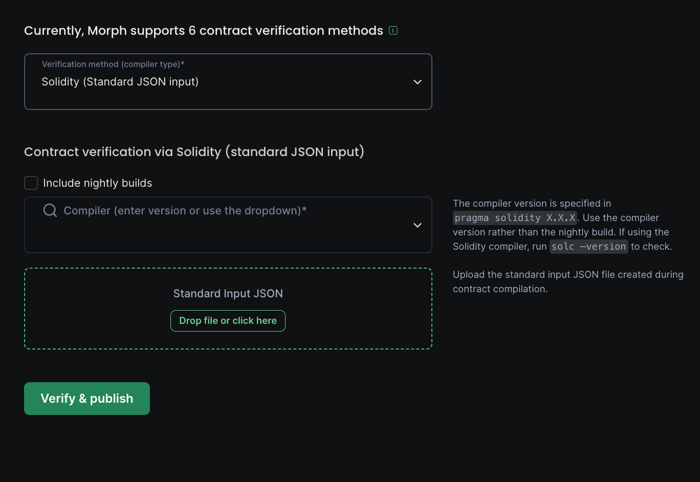
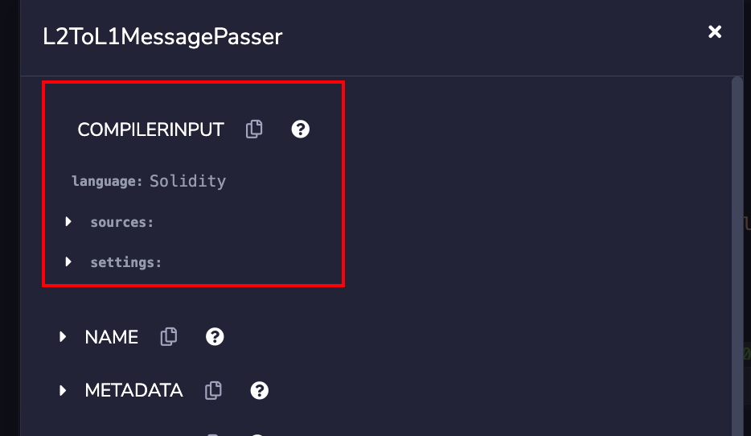
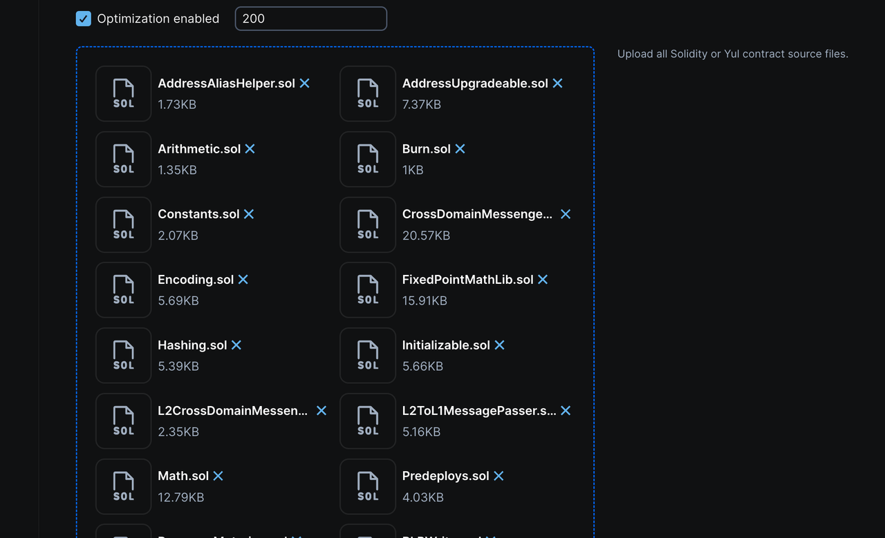
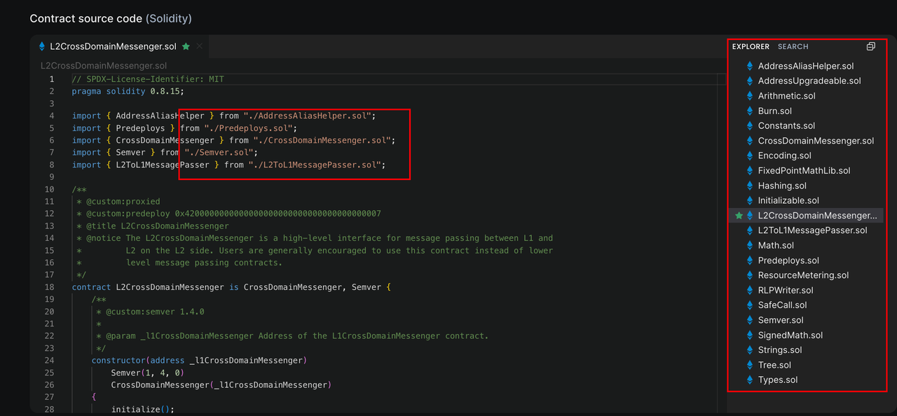
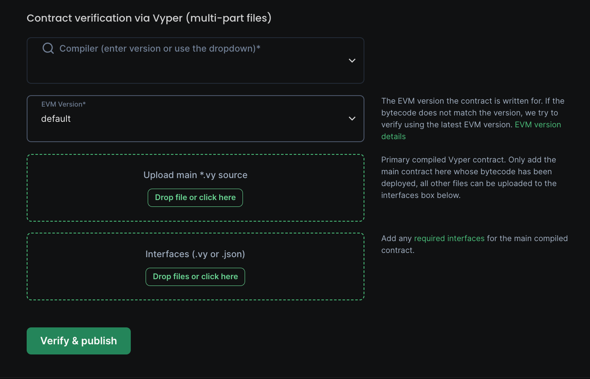
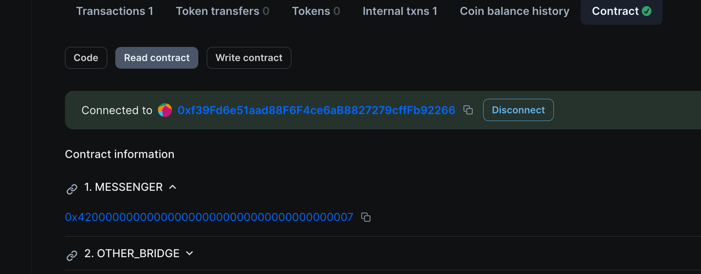

After deploying your smart contracts, it's crucial to verify your code on our [block explorer](https://explorer-holesky.morphl2.io). This can be automated using your development framework, such as Hardhat.


## Verify with development framework

Most smart contract tools have plugins for verifying contracts on Etherscan. Blockscout supports Etherscan's contract verification APIs, making it straightforward to use these tools with the Morph Mainnet & Testnet.

### Verify with Hardhat

To verify your contract through hardhat, you need to add the following Etherscan and Sourcify configs to your hardhat.config.js file:

```javascript
module.exports = {
  networks: {
    morph: { ... }
  },
  etherscan: {
    apiKey: {
      morph: 'anything',
    },
    customChains: [
      {
        network: 'morph',
        chainId: 2818,
        urls: {
          apiURL: 'https://explorer-api.morphl2.io/api? ',
          browserURL: 'https://explorer.morphl2.io/',
        },
      },
    ],
  },
};
```

### Verify with Foundry

Verification with foundry requires some flags passed to the normal verification script. You can verify using the command below:

```bash
 forge verify-contract YourContractAddress Counter\
  --chain 2818 \
  --verifier-url https://explorer-api.morphl2.io/api? \
  --verifier blockscout --watch
```

## Verify with Morph explorer frontend

- Visit：[Morph block explorer](https://explorer.morphl2.io)

We currently support 6 different ways to verify your contracts on our block explorer.

There are 2 general parameters:

- Compiler: Has to be consistent with what you select when deployment.
- Optimization: Can be ignored if you don't have contract optimization. If you do, it has to be consistent with deployment.

### Method: Solidity (Flattened Source Code)

#### Frontend:


#### Flatten

Flatten through [forge command](https://book.getfoundry.sh/reference/forge/forge-flatten?highlight=flatten#forge-flatten), for example:

~~~
forge flatten --output FlattenedL2StandardBridge.sol ./contracts/L2/L2StandardBridge.sol
~~~

### Method: Solidity (Standard JSON Input)



#### Obtain JSON File

- Can be obtained through solc
- Can be obatined through remix compiler




### Method: Solidity (Multi-part files)

#### Frontend:

- You can submit multiple contract file by your own needs


#### SOL File Process
- If there is any imported file, it needs to be modified to be referenced by the same level path, and these files must be submitted together. 

### Method: Vyper (Contracts)

#### Frontend:

### Method: Vyper (Standard Json Input)

#### Frontend:

### Method: Vyper (Multi-part files)

#### Frontend:


### After Verification




