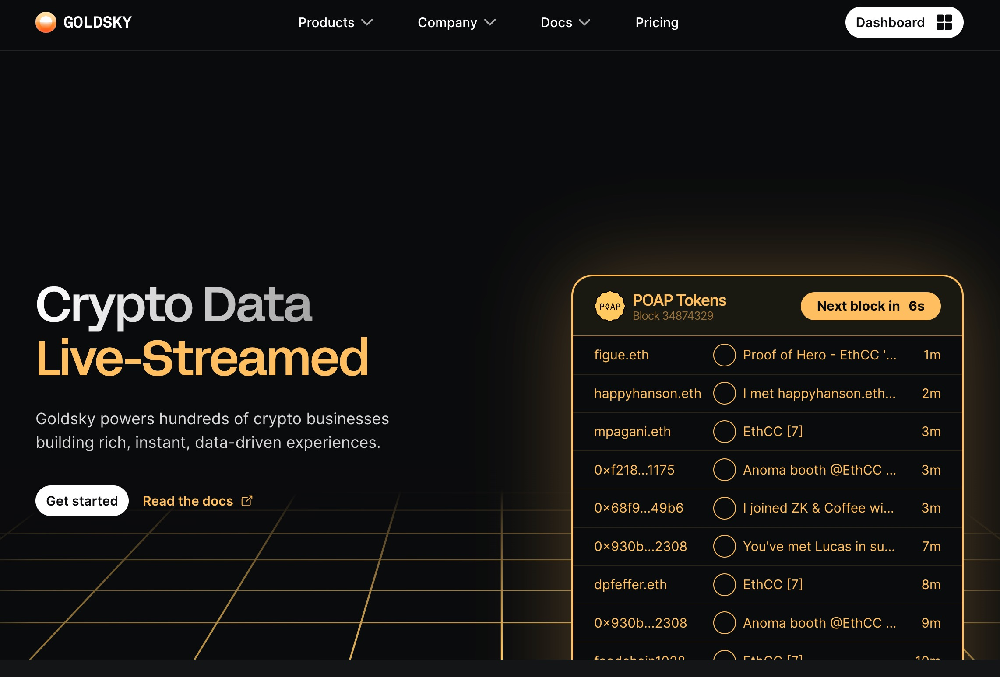

Besides the official tools and resources, we have also partnered other infrastructure projects to help builders on Morph, here is the list of the projects that has been live on Morph holesky testnet now. 

:::tip More partners coming soon

As Morph is still in beta testnet stage, we are working closely to complete the infrastructure cooperations, to ensure clear instructions, patners that is still working on holesky testnet integration is not listed, we will keep updating this page.
:::

<!--
### 3rd Party Bridges

[LayerZero]()

[Orbiter Finance]()

[Axelar]()
-->

### Account Abstraction

#### Biconomy

Documentation: https://docs.biconomy.io/

Integration for Morph Holesky is still in process, more details coming soon

### Blockchain Indexing Services

#### Goldsky

We have partnered with Goldsky to provide indexing and subgraph services for Morph Holesky and Morph Mainnet.

Goldsky also allow us to grant selected developers with free subgraph services now, if you want to deploy subgraph with Goldsky, please raise a ticket in our discord to let us know how we can help.

For more information, please refer to [their documentation](https://docs.goldsky.com/chains/morph)

### Oracles

#### Pyth Network

Documentation: https://docs.pyth.network/price-feeds

Right now Pyth is deployed on Morph Sepolia and integrating on Morph Holesky soon.

### MultiSig

#### Morph Safe

We have partnered with [Protofire](https://www.protofire.io/) to create Morph Safe for multisig services on Morph.

Please refer to the docs about [How to create a safe multisig on Morph](../developer-resources/4-create-a-safe-multi-signature-wallet.md)

### Explorer

Besides the official [Morph explorer](https://explorer-testnet.morphl2.io/), we have also partnered with 3rd party providers for different Morph blockchain data presentations forms

#### Socialscan

Track Morph Testnet transactions and wallets on the [SocialScan Explorer](https://morphl2-testnet.socialscan.io/).

