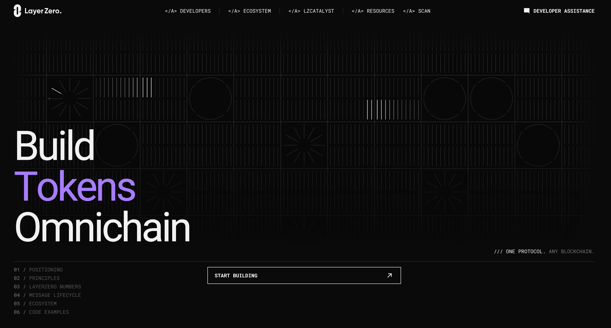

### LayerZero

LayerZero is a messaging protocol, not a blockchain. Using smart contracts deployed on each chain, in combination with Decentralized Verifier Networks (DVNs) and Executors, LayerZero enables different blockchains to seamlessly interact with one another.

You can find our network's endpoint [here](https://docs.layerzero.network/v2/developers/evm/technical-reference/deployed-contracts#morph)

We wrote a complete guide on [how to leverage LayerZero's technology on Morph:](https://morph.ghost.io/layerzero-v2-morph-seamless-cross-chain-token-transfers/)

