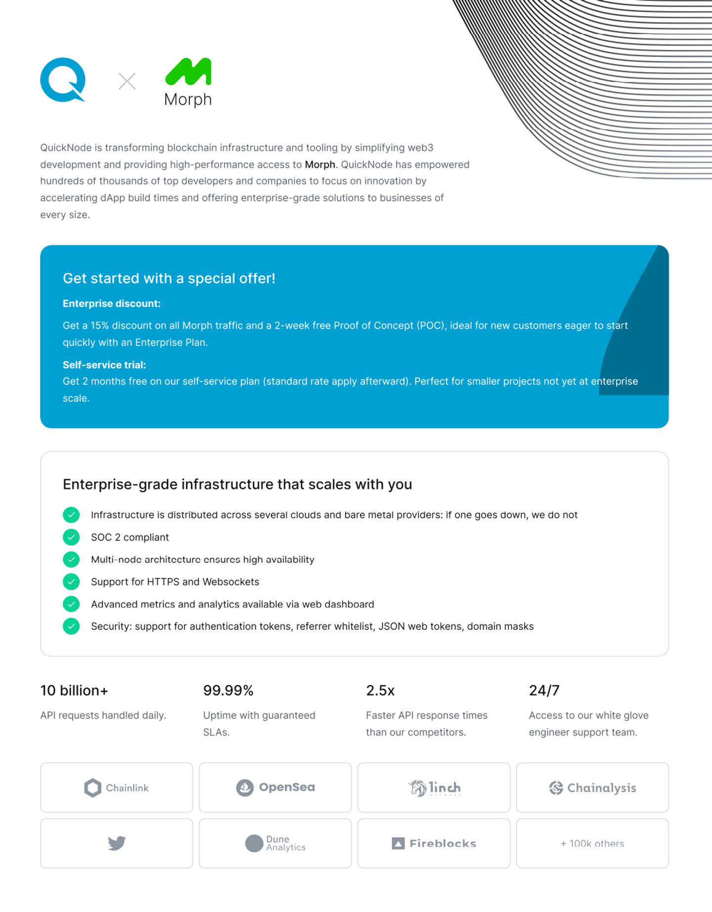
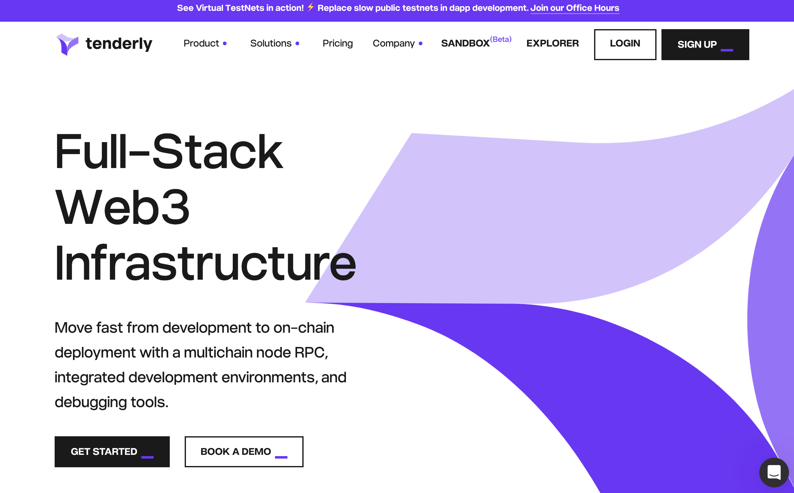

### QuickNode

QuickNode is transforming blockchain infrastructure and tooling by simplifying web3 development and providing high-performance access to Morph. 

Developers in the Morph ecosystem are now eligible for free QuickNode credits/discounts!

Read more about what you can get here:

[QuickNode Partnership](https://quicknode.notion.site/QuickNode-Benefits-for-Morph-Developers-4baf42f78dd64f389a2405e61350a0a6)

### Tenderly

Tenderly is a full-stack Web3 infrastructure – node RPC, dev environments & exploration tools. 

Build & scale with ease. Get started [here](https://blog.tenderly.co/building-dapps-on-morph-with-tenderly/)

### OpenChainBench

For live latency comparisons across free public Morph RPC endpoints, see [OpenChainBench](https://openchainbench.com/benchmarks/morph-rpc) — an open benchmark that continuously measures response times across providers so you can pick the fastest endpoint for your use case.
