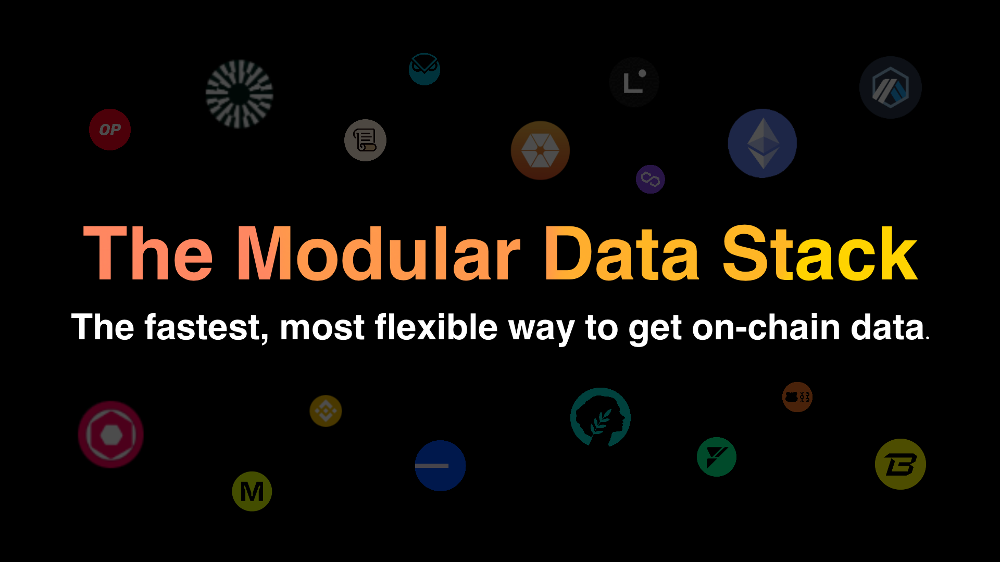

### Goldsky

We have partnered with Goldsky to provide indexing and subgraph services for Morph Holesky and Morph Mainnet.

Goldsky also allow us to grant selected developers with free subgraph services now. If you want to deploy a subgraph with Goldsky, please raise a ticket in our Discord to let us know how we can help.

For more information, please refer to [their documentation](https://docs.goldsky.com/chains/morph).

### Envio

Envio is a modern, multi-chain EVM blockchain indexing framework speed-optimized for querying real-time and historical data on Morph Holesky and Morph Mainnet. 

Designed with a core focus on delivering superior performance and seamless developer experience, Envio empowers the next generation of consumer apps. 

The [Quickstart](https://docs.envio.dev/docs/HyperIndex/contract-import) allows you to instantly autogenerate a basic indexer and query your smart contract data on Morph. This is the quickest way to get going and likely the starting point for most developers.

For more information, please refer to [their documentation](https://docs.envio.dev). 

Click [here](https://envio.dev/explorer) for live indexer examples to be inspired.  