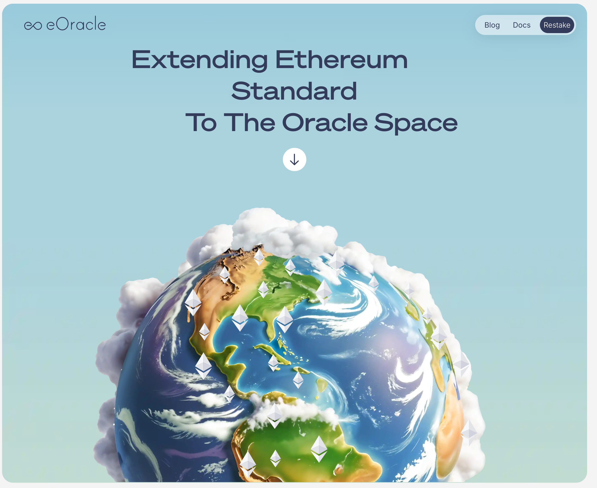

### Pyth Network

Documentation: https://docs.pyth.network/price-feeds

Right now Pyth is deployed on Morph Mainnet, check the [contract](https://explorer.morph.network/address/0x2880aB155794e7179c9eE2e38200202908C17B43).

### eOracle

eOracle is currently in the process of integrating Morph mainnet.

<!-- Deployed Morph Hoodi testnet [contract](https://explorer-holesky.morph.network/address/0xbd53b35Bf458Cd22dBDeB5Da71181daA3cFb6A10) -->

Full price feeds and docs can be found here : https://eoracle.gitbook.io/eoracle/price-feeds/feed-addresses.
