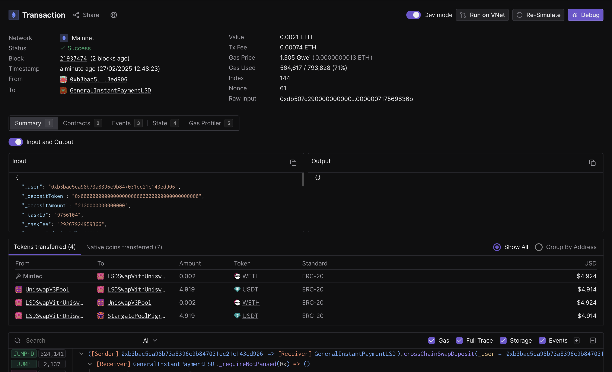

Besides the native [Morph explorer](https://explorer.morphl2.io/), we have also partnered with 3rd party providers for different Morph blockchain data presentations forms.

### Socialscan

Track Morph transactions and wallets on the [SocialScan Explorer](https://morphl2.socialscan.io/).

### Tenderly Developer Explorer

The [Developer Explorer](https://docs.tenderly.co/developer-explorer?mtm_campaign=ext-docs&mtm_kwd=morph) helps developers effectively manage, debug, and monitor their Morph projects. Set up critical [alerts](https://docs.tenderly.co/alerts/intro-to-alerts?mtm_campaign=ext-docs&mtm_kwd=morph) on contracts to proactively respond to issues and improve security practices. Leverage Developer Explorer with [Virtual TestNets](https://docs.tenderly.co/virtual-testnets?mtm_campaign=ext-docs&mtm_kwd=morph) during the entire dapp development process, from testing to staging and go-live. 

