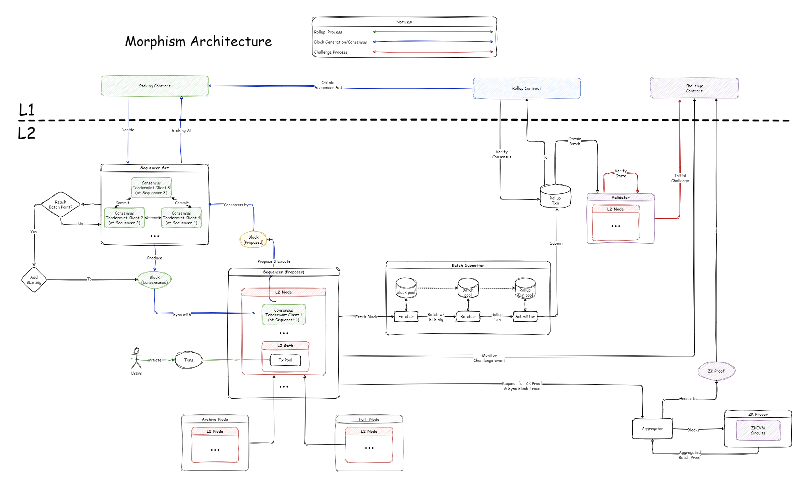
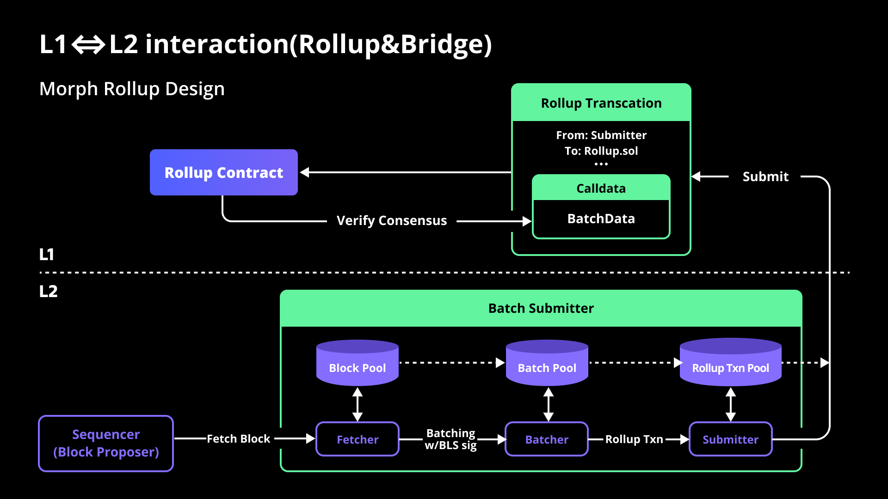

The modular design of blockchain technology, known for its improved composability, has become a prevalent trend. Morph leverages this design principle to enhance its architecture and functionality.

## Overview

A modular design typically divides a Layer 1 blockchain into four core functions:

1. Consensus
2. Execution
3. Data Availability
4. Settlements

Morph applies this modular approach to its Layer 2 solution by dividing it into three primary modules, each responsible for specific functionalities.

### 3 Major Morph Modules

#### Sequencer Network - Consensus & Execution

Sequencer network responsible for the execution & consensus of the Layer 2 transactions, for more details please refer to Morph's [decentralized sequencers](../how-morph-works/decentralized-sequencers/morph-decentralized-sequencer-network).

#### Optimistic zkEVM - Settlement

State verification ensures that state changes on Layer 2 are valid on Layer 1. Morph introduces Optimistic zkEVM, a hybrid solution combining zk-rollups and optimistic rollups for state verification. The process involves a Morph innovation known as Responsive Validity Proof (RVP). This innovative approach finalizes and settles Layer 2 transactions and states efficiently. For more details, refer to the documentation on [Responsive Validity Proof](../how-morph-works/optimistic-zkevm).

#### Rollup - Data Availability

The [Rollup](../how-morph-works/general-protocol-design/1-rollup.md) process involves submitting Layer 2 transactions and states to Layer 1, ensuring data availability. Morph's rollup strategy maximizes efficiency by compressing block content using zk-proofs, which helps manage the cost of Layer 1 data availability. 

### 5 Morph Roles

#### Sequencers

Sequencers play a crucial role in the network by:

- Receiving Layer 2 user transactions and forming blocks.
- Reaching consensus with other sequencers.
- Executing blocks and applying state transitions.
- Batching blocks and submitting them to Layer 1.
- Synchronizing blocks with full nodes.
- Generating validity proofs when challenged.

#### Prover

Provers are essential for generating zk proofs when a sequencer is challenged. They synchronize Layer 2 transaction information and produce the necessary zk proofs to validate state changes.

#### Validator

Validators can be any user and play a key role in ensuring the correctness of states submitted by sequencers to Layer 1. They maintain an L2 node to synchronize transactions and state changes, triggering challenges when incorrect states are identified.

#### Nodes

Nodes facilitate easier access to Layer 2 transactions and states without actively participating in network operations. Running an L2 node is open to anyone and does not require permission.

#### Layer 1

Every Layer 2 solution relies on a Layer 1 blockchain for final settlements and data availability. For Morph, this role is fulfilled by Ethereum. Key contracts on Layer 1 ensure the security and finality of Layer 2 transactions and states.

### 6 Morph Components

#### L2 Node​

The L2 node is central to Morph's architecture, interacting with various modules and roles. It includes sub-components such as:
- Transactions Manager (Mempool): Manages all Layer 2 transactions, accepting and storing user-initiated transactions.
- Executor: Applies state transitions and maintains the real-time status of Layer 2.
- Synchronizer: Synchronizes data between L2 nodes to restore network status.

#### Batch Submitter​
The Batch Submitter is part of the sequencer, responsible for continuously obtaining L2 blocks, packaging them into batches, and assembling the batches into Layer 1 transactions, which are then submitted to the Layer 1 contract.

#### Consensus Client​
Each sequencer runs a consensus client to reach consensus with other sequencers. The current design uses the Tendermint client to ensure seamless integration and developer friendliness.

#### zkEVM​
zkEVM is part of the Prover and is a zk-friendly virtual machine used to generate zk proofs for Ethereum blocks and state changes. These zk proofs are ultimately used to prove the validity of L2 transactions and states.

#### Aggregators​
Aggregators work with zkEVM to reduce the cost of verifying zk proofs by aggregating them for block production.

#### Layer 1 Contract​
These contracts on Ethereum store Layer 2 transactions, execute global state changes, and bridge assets and information between Layer 2 and Layer 1. They also manage the election and governance of the sequencer set, inheriting the security of Ethereum.

### Integration of Components, Roles, and Modules

The components form the foundation of the various roles in Morph. For instance, running an L2 node allows one to become a Node, while adding batch submitter and consensus client functionalities enables the role of Sequencer. These roles collaborate to perform the core functions of Morph, creating a complete and efficient rollup solution.