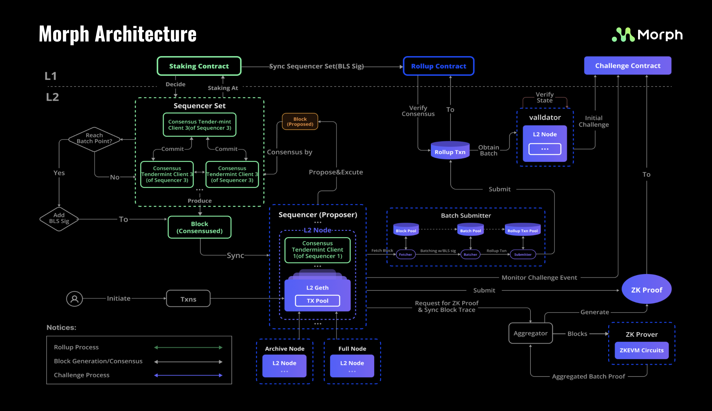
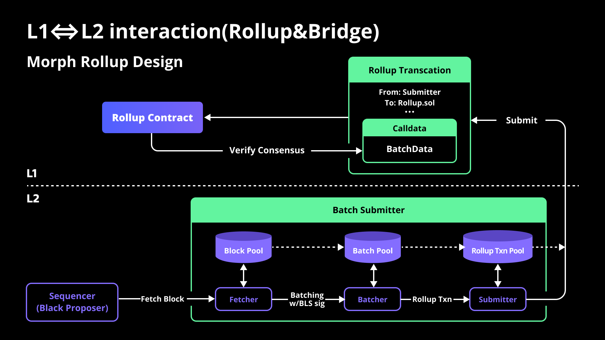

Due to its improved composability, the modular design of blockchain has become a trend, and we have incorporated this design into the construction of Morph. 

Firstly, morphs are divided into three important modules, various roles carry out their respective responsibilities to ensure the module operates seamlessly, with each role being comprised of distinct components. These underlying components effectively collaborate with one another while preserving their individual autonomy.

The skeletal architecture of Morph is shown below:

## Overview

Modular is generally a term to describe an architectural design idea in which, a Layer 1 blockchain can be divided into four functions:

1. Consensus
2. Execution
3. Data Avaibility
4. Settlements

We believe that Layer 2 can also apply this.

Following this, we first divided Morph (or any other Layer 2) into 3 Modules, each module performs the mentioned functionality

### 3 Major Morph Modules

#### Sequencer Network - Consensus & Execution

Sequencer network responsible for the execution & consensus of the Layer 2 transactions, for more details please refer to Morph's [decentralized sequencers](../how-morph-works/decentralized-sequencers/morph-decentralized-sequencer-network)

#### Optimistic zkEVM - Settlement

For every Layer 2 project, they need to conduct the state verification methods to make sure the state change on Layer 2 is valid on Layer 1.

For zkRollups, it's zkEVM, and for optimistic rollups, it's fraud proof.

Morph has the unique design of this, we introduced [Optimistic zkEVM](../how-morph-works/responsive-validity-proof/2-why-rvp.md) as a new hybrid solution of state verifications. 

The state verification process finalizes and settles Layer 2 transactions and states.

#### Rollup - Data Avaibility

[Rollup](../how-morph-works/general-protocol-design/1-rollup.md) is the process where Layer 2 submits L2 transactions and states to Layer 1.

As a result, all Layer 2 data is accessible on Layer 1, achieving data availability.

Morph's rollup strategy maximizes efficiency. A transaction includes multiple batches, and a batch includes multiple blocks. Additionally, leveraging the zk-proof feature, the content of the blocks is compressed to effectively manage the cost of Layer 1 data availability.

### 5 Morph Roles

#### Sequencers

As the most important part of the network, sequencers serve the following functions:

1. Receiving Layer 2 users' transactions and form the block (L2 Node)
2. Reach block consensus with other sequencers (Consensus)
3. Execute blocks and apply state transmission (L2 Node)
4. Batch the blocks and submit them to Layer 1 along with the new Layer 2 state ()
5. Sync the blocks with full nodes
6. Utilize provers to generate validity proof when being challenged

#### Prover

Prover is an indispensable part of the Morph architecture. When a sequencer is challenged by a validator, in order to prove its innocence, the sequencer needs to call the prover to generate zk proofs for the corresponding state change. 

The Prover module needs to maintain 3 components: L2 Node, zkEVM and aggregator. 

It will synchronize the required Layer 2 transaction information through L2 Node and generate corresponding zk proofs through zkEVM component.

Under the current framework of Morph, the prover is only called when the sequencer is challenged due to inefficient performance and high cost in generating zk proofs with current technology conditions. 

After relevant issues are properly resolved in the future, Morph will be converted into a complete ZK Rollup that generates zk proof for each Layer 2 block.

#### Validator

Validator is a role that can be taken on by any user, and becoming a validator is completely permissionless. 

Validators need to determine whether the state submitted by the Sequencer to L1 is correct, and the best way to do this is to maintain an L2 Node that synchronizes transactions and state changes in L2.

When a validator identifies an incorrect state, they can trigger a challenge by calling the contract's method, which will require the sequencer to generate and submit a zk proof for the challenged block.

#### Nodes

Nodes do not actively contribute to the functioning of the network or carry out any tasks; rather, they exist in order to facilitate easier access to the transactions and state of L2. 

Becoming a node requires running an L2 Node, and this process is open to anyone without the need for permission. 

Nodes can be categorized as general or archive nodes based on the kind of data they manage, with archive nodes storing a greater amount of state and transaction data than general nodes.

#### Layer 1

Every Layer 2 needs a Layer 1, for Morph, it's Ethereum.

Layer 1 serves the role that provides data availability and final settlements.

Morph deployed several important contracts to let Layer 1 as the final judges and data storage place. This is a must for all layer 2s if they want to ultimately inherit the safety of Ethereum.

### 6 Morph Components

#### L2 Node

The L2 node plays a pivotal role in overall architectural design, serving as a hub for multiple other modules to interact and exchange information through. Various roles require L2 nodes as an integral part of their normal operation.

The L2 node itself is also divided into different components, each with its own specific function:

##### Transactions Manager (Mempool)

The L2 node will use this component to manage all Layer 2 transactions, including:

1. Accepting user-initiated transactions and storing them in the Mempool
2. Responding to the consensus layer by providing the latest transactions from the Mempool for block generation when certain conditions are met
3. Recording and storing Layer 2 transactions.

##### Executor

The L2 node will maintain the real-time status of Layer 2, and currently Morph has made some modifications to Geth specifically for ZK-Proof, using it as the execution layer. After receiving consensus-approved blocks, the L2 node applies them to the current state to achieve state transition.
Based on this logic, the execution layer ensures Ethereum compatibility and allows developers to have a consistent development experience.

##### Synchronizer

There is often a need for synchronization between L2 nodes to restore network status, so the L2 node includes a synchronizer to synchronize data with each other. The frequency and functionality of synchronization vary depending on the role used. For example, for an L2 node running a sequencer, it will first synchronize blocks among various sequencers to achieve consensus, and then synchronize blocks to full nodes. As for full nodes, other roles in the network, such as validator and prover, will synchronize blocks from the full node to complete their work.

#### Batch Submitter

Batch Submitter is part of the sequencer, responsible for continuously obtaining L2 Blocks to package them into a Batch and assemble the Batch into a Layer 1 Tx, which is ultimately submitted to the Layer 1 contract.

#### Consensus Client

Based on our decentralized sequencer network design, each sequencer needs to run its consensus client to reach consensus with other sequencers. In the current design, we use the Tendermint client to ensure friendliness and seamless integration for developers.

#### zkEVM

zkEVM is part of the Prover and is a zk-friendly virtual machine used to generate zkProof for Ethereum blocks and state changes. These zkProofs are ultimately used to prove the validity of L2 transactions and states.

#### Aggregators

Aggregators and zkEVM together form the Prover, which aggregates zk proofs for block production to reduce the cost of verifying zk proofs.

#### Layer 1 Contract

On Layer 1 (Ethereum), each Layer 2 needs to deploy corresponding contracts. The functions of these contracts generally include 
- Storing Layer 2 transactions, 
- Executing global state changes in Layer 2
- Bridging assets and information between Layer 2 and Layer 1. 
  Additionally, based on the decentralized sequencer design of Morph, the contracts are responsible for:
- Electing and maintaining the sequencer set
- Governance

The existence of these contracts allows Layer 2 to inherit the security of Layer 1, as the invocation and execution of these contracts need to be verified by millions of validators on Ethereum.

### Components -> Roles -> Modules

The underlying layer is the components, and different components together you can perform the duty of the roles we talked about.

For example, if you run a L2 node, you can become the role of Node.

If you run batch submitter & consensus client too, you can perform the duty of sequencers.

And together, these roles can work with each other to realize the major functions.

And the major functions together become Morph, a complete Rollup.