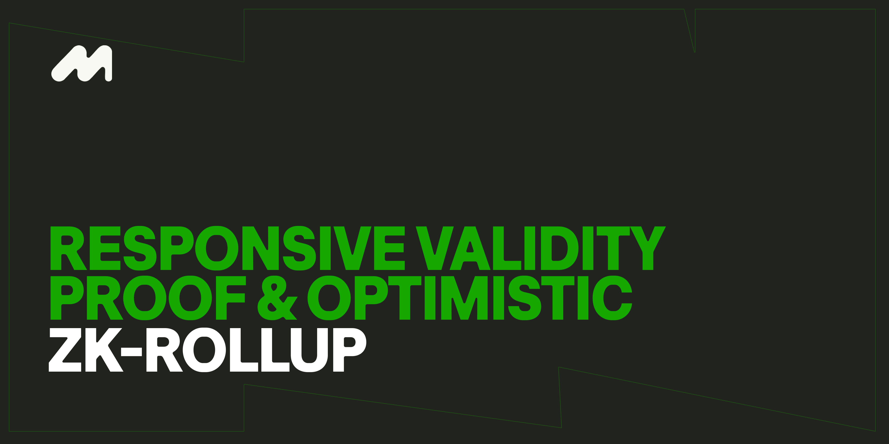

## Introduction to State Verification

Layer 2 state verification traditionally falls into two categories: fraud proofs and validity proofs. Morph introduces a new verification method called Responsive Validity Proof (RVP), combining the benefits of both approaches to address their limitations. Fraud proofs, while effective, suffer from capital inefficiency and low security assumptions. Additionally, no Optimistic Rollup (OP-Rollup) has fully implemented a permissionless fraud-proof challenge mechanism. Conversely, validity proofs offer high security but face practical issues with cost and efficiency that hinder Rollup scalability.

## The Problem with Optimistic Rollups

In this model, Layer 2 (L2) optimistically assumes that the state changes submitted by the sequencer are valid without actively verifying their authenticity. Instead, a challenge period is introduced before the state changes are confirmed on Layer 1 (L1). During this period, external challengers verify the sequencer's submissions based on their own synchronized network status. If they find discrepancies, challengers can trigger a challenge process on L1 to prevent incorrect states from being confirmed.

**Challenge Mechanism**: Although all optimistic rollups claim to implement fraud proofs, only a very few had successfully deployed them on the mainnet. Furthermore, the challengers are often limited to several whitelisted addresses. Fraud proofs in current optimistic rollup projects can be categorized into two types:

**Non-Interactive Fraud Proofs**: When a new state submitted by the sequencer is challenged, L1 re-executes all corresponding L2 transactions to generate a valid state for comparison with the state submitted by the sequencer. This process incurs significant gas costs and may lead to discrepancies between L2 and L1, as some transactions might produce different outcomes on L2 compared to L1, or L1 might not be able to execute certain L2 transactions. Optimism (OP) once used this approach but abandoned it due to these issues.

**Interactive Fraud Proofs**: To address the issues of non-interactive fraud proofs, multi-round interactive fraud proofs were introduced. This method involves determining the specific instruction execution that caused the incorrectness through multiple rounds of interaction between the sequencer and the challenger, then confirming fraud by executing the corresponding instructions on L1. This approach reduces computational costs and diminishes the issue of incongruent outcomes between L1 and L2. However, it introduces complexities, such as:
- Higher implementation difficulty
- Longer challenge periods (sufficient time must be reserved for complex interactions)
- Increased standards, impacting challengers' motivation

Currently, only several OP Rollups have implemented a complete interactive fraud proof mechanism on its mainnet among optimistic rollup projects. In contrast, several ZK-rollup projects have already launched on the mainnet.

These complexities highlight the need for improvement in existing optimistic rollup models. Hence, Morph introduces the Responsive Validity Proof (RVP).

## What is RVP?​

Responsive Validity Proof (RVP) integrates ZK-based validity proofs into the optimistic rollup framework. The process is as follows:

When challengers detect that the sequencer has submitted incorrect data, they initiate a challenge request to the sequencer on Layer 1 (L1). The sequencer must then generate the corresponding Zero-Knowledge (ZK) proof within a specified time (challenge period) and pass the verification of the L1 contract. If the verification passes, the challenge fails; otherwise, the challenge succeeds. This process combines the benefits of optimistic rollups and ZK-rollups, providing a balanced approach to security and efficiency.

### Advantages of RVP Compared to Interactive Fraud Proofs

1. **Shorter Challenge Period**: RVP can reduce the challenge period from the typical 7 days to just 1-3 days, improving overall efficiency and user experience. Right now the Morph mainnet has 48 hrs (2 days) challenge window.
2. **Reduced L2 Submission Costs**: By using validity proofs, Layer 2 (L2) does not need to include most transaction bytes, significantly lowering submission costs.
3. **Improved Challenger Experience**: With RVP, challengers only need to initiate the challenge. The sequencer must prove their correctness by generating and verifying the corresponding ZK-proof, simplifying the challenger's responsibilities.
4. **Seamless Transition to ZK-Rollup**: The architectural design of RVP allows for an easy transition to a complete ZK-rollup. The primary change required is adjusting the sequencer's ZK-proof submission methods from responsive to active.

RVP enhances the optimistic rollup model by incorporating ZK-proofs, offering a more efficient, cost-effective, and secure solution. It addresses the limitations of traditional fraud proofs and paves the way for a seamless transition to full ZK-rollup implementations in the future.

### How Can RVP Shorten the Challenge Period of an Optimistic Rollup?	
#### The Need for a Challenge Period
Optimistic rollups incorporate a challenge period (or withdrawal period) to ensure that any malicious submissions by the sequencer can be identified and contested. This period provides sufficient time for challengers to verify transactions, conduct fraud proofs, and complete the challenge process, thereby ensuring that only valid state changes are confirmed on Layer 1 (L1).
Two main factors influence the length of the challenge period:
1. Completion Time: The time required for both parties to complete the challenge process.
2. Mitigating Malicious Behavior: Ensuring that there is enough time to address any attempts by sequencers to maliciously block the challenger’s transactions on L1.

#### Solutions to Shorten the Challenge Period
**Concise and Direct Challenge Process:** For multi-round interactive fraud proofs, the entire challenge process might require several rounds of interaction, each demanding significant time. For example, if the process requires 10 rounds, at least 20 blocks of time are needed to complete the challenge, considering the back-and-forth responses.
In contrast, RVP simplifies the challenge process by requiring only one interaction: the sequencer uploads the ZK-proof of the batch, which is then verified on L1. This streamlined process addresses the main problem of whether challengers have enough time to detect and prove incorrectness, thus significantly reducing the challenge period.

**Protection Against Malicious Behavior**: In interactive fraud-proof systems, the challenged party might attempt to interfere with the challenge progress, such as launching a DoS attack on L1 to prevent challengers from interacting with L1 and submitting proofs.
With RVP, challengers only need to trigger the challenge. Once the challenge is initiated, the sequencer has no opportunity to interfere. The sequencer must then prove the correctness of its submission through the ZK-proof. This ensures that the normal challenge process is not affected by malicious behavior, further shortening the challenge period.

#### Key Benefits of RVP in Reducing the Challenge Period
- **Efficiency**: The single interaction required for RVP simplifies the challenge process, reducing the time needed for resolution.
- **Security**: By relying on ZK-proofs, RVP provides a robust mechanism to validate state changes without lengthy interactions.
- **Cost-Effectiveness**: The reduction in the number of interactions lowers the gas costs associated with challenge processes on L1.

By addressing these factors, RVP effectively shortens the challenge period from the traditional 7 days to just 1-3 days, offering a more efficient and secure solution for optimistic rollups.

### Why is the Operating Cost Lower for L2 Based on RVP?	

#### Compression of Transactions

In ZK-rollups, the validity of each transaction is confirmed through a submitted ZK-proof, which eliminates the need to include extensive transaction details. For example, the length of an Ethereum transaction is approximately 110 bytes, with the signature occupying around 68 bytes. In optimistic rollups, because transactions need to be replayed on L1, these signatures must be included to ensure validity. This increases the cost.
However, ZK-rollups only need to retain basic transaction information because the validity proof covers the entire batch. This compression capability reduces the amount of data that needs to be submitted to L1, significantly lowering costs.

#### Efficient Data Submission

RVP utilizes ZK-proofs to validate transactions, adopting the ZK-rollup advantage of transaction compression during batch data submission. This reduces the overall data volume and associated costs. Additionally, when there are no challenges, the sequencer does not incur the cost of generating and submitting ZK-proofs, further lowering operational expenses.

#### Comparison with Existing Solutions

The design of RVP ensures that the cost of rollup operations is lower than that of both existing optimistic rollups and traditional ZK-rollups. This efficiency is achieved by:
- Reducing the need for detailed transaction replays on L1.
- Leveraging ZK-proofs only when necessary, minimizing unnecessary proof generation costs.

### RVP is Friendly to Challengers
The core of RVP is the use of validity proofs to ultimately validate challenged data. This benefits challengers in the following ways:
1. **Simplified Challenge Process:**
- In RVP, the sequencer is responsible for generating and verifying proofs. Challengers only need to initiate a challenge through staking, reducing the complexity and burden on challengers.
- This contrasts with traditional fraud proofs, where challengers must interact multiple times with the sequencer, making the process cumbersome and complex.
2. **Lower Threshold for Challengers**:
- In many Layer 2 projects, sequencers have a high incentive to act maliciously due to potential high returns. Conversely, challengers typically see lower direct benefits, leading to a lack of motivation to challenge fraudulent transactions.
- RVP lowers the threshold for challengers by shifting the responsibility of proof generation to the sequencers, thus increasing the likelihood of detecting and correcting fraudulent behavior.
3. **Mitigating Malicious Challenges**:
- While there is a risk of challengers initiating unnecessary challenges to increase costs for sequencers, RVP mitigates this by requiring challengers to compensate sequencers for the costs incurred if a challenge is unsuccessful.
- This mechanism discourages frivolous challenges and ensures that only legitimate disputes are raised.

By adopting these strategies, RVP ensures a fairer and more efficient process for validating Layer 2 transactions, ultimately lowering operating costs and enhancing the security and integrity of the network.

### Why do sequencers have to take on the responsibility of submitting ZK-proofs?​

Some proposals have suggested that challengers could demonstrate the falsehood of a sequencer's submission by providing their own submission and corresponding ZK-proof. The two submissions could then be compared to identify any fraudulent activity by the sequencer. However, there are significant concerns with this approach:

Challengers would need to generate ZK-proofs using the transactions provided by the sequencer. If the sequencer submits invalid transactions, challengers cannot create ZK-proofs that can be authenticated on Layer 1 (L1). Therefore, it is more effective for sequencers to prove the correctness of their submissions. This approach ensures that the entity responsible for the transactions verifies their accuracy, maintaining the integrity of the system..
### Why Not Simply Employ ZK-Rollups?

While verifying the validity of every state submission by the sequencer through numerous cryptographic calculations, as seen in current ZK-rollups, theoretically offers higher security, this approach presents several challenges:

#### The Cost of ZK-Rollup

Currently, projects such as zkSync and Polygon zkEVM have launched on the mainnet, showing that generating and verifying ZK-proofs is no longer the most pressing issue. However, these ZK-proofs still face cost and efficiency constraints. For instance, the average transaction cost on zkSync Era ranges from \$0.51 to as high as \$310, depending on L1 gas fees. This is significantly more expensive than the transaction costs of optimistic rollup projects like Arbitrum and Optimism. In contrast, with RVP, the high cost is avoided during normal network operation by only compressing transaction data using ZK-proofs when challenged. Normal operation incurs minimal costs, maintaining efficiency and affordability.

#### Block Finalization Time in ZK-Rollups

Theoretically, ZK-rollups should have no withdrawal period because the entire L2 state transition verification process through ZK-proof should be completed in minutes or even seconds. However, the practical reality is different. Due to technical limitations, the time required for final verification of ZK-proofs on L1 is much slower than expected. For example, zkSync Era takes about 20-24 hours for L2 blocks to be finalized, which is not significantly different from the optimized withdrawal periods of optimistic rollups.

#### Seamless Transition with RVP-Based Rollups

L2 scaling solutions incorporating RVP technology can be designed using the ZK-rollup framework, allowing for an easy transition from RVP-based L2 to standard ZK-rollup L2 as ZK technology matures. The primary adjustment needed is changing the sequencer's ZK-proof submission methods from responsive to active. Thus, RVP-based systems can seamlessly adopt full ZK-rollup benefits in the future.

### SP1 on Morph Mainnet

Morph’s Responsive Validity Proof (RVP) system morphed into the optimal design with our mainnet launch, enhanced by SP1.

Succinct, uniquely enables Morph’s RVP with their blazing fast zkVM and excellent developer experience. It represents a generational shift in how zkEVMs are built, custom circuits are a relic of that past. This upgrade refines RVP's capabilities, pushing the boundaries of scalability and security in blockchain applications.

Our RVP system with SP1 is:

- Uses a generic, more developer-friendly Rust-based implementation
- Generates proofs orders of magnitudes faster with SP1’s Prover Network 
- Handles unlimited transactions per block (previously capped at 100)

For users, this means:

- Improved security and smoother user experience (thoroughly audited codes with faster challenge resolution and 2-day settlement)
- Lower costs (more efficient proof generation for off-chain computation)
- More scalable (no more transaction caps)

### Morph Challengers Address List

As per our commitment to the decentralization of the challenging process, here is the list of all challenger addresses.

These addresses are responsible for monitoring the L2 state changes and responding to any malicious activities from the sequencers.

#### Challenger Address List

- [0x731a89035F88Bde8fB7357AaAD6620F4716aC1be](https://etherscan.io/address/0x731a89035F88Bde8fB7357AaAD6620F4716aC1be) - [Hashkey](https://www.hashkey.com/)
- [0x111bc31f5cfe920004fd17449bdb5e476c02aec5](https://etherscan.io/address/0x111bc31f5cfe920004fd17449bdb5e476c02aec5) - [Metis](https://www.metis.io/)
- [0x3b065b18edffc7cf3d751e33d45c1fb4fd78d57b](https://etherscan.io/address/0x3b065b18edffc7cf3d751e33d45c1fb4fd78d57b) - [L2scan](https://www.l2scan.co/)
- [0xa609285fF6F2a0Dfdeb03cc33d78d8a47A691497](https://etherscan.io/address/0xa609285fF6F2a0Dfdeb03cc33d78d8a47A691497) - [Tenderly](https://tenderly.co/)
- [0x8b8bc0EB904fDD2862a6433d020F15bBc8a7b13e](https://etherscan.io/address/0x8b8bc0EB904fDD2862a6433d020F15bBc8a7b13e) - [Redstone](https://www.redstone.finance/)
- [0xAa54d89A2B420F286Db0C19732D07abe08E6b442](https://etherscan.io/address/0xAa54d89A2B420F286Db0C19732D07abe08E6b442) - [Redstone](https://www.redstone.finance/)
- [0x77b29534738e3f0f297d36635d7884965c7c8ce1](https://etherscan.io/address/0x77b29534738e3f0f297d36635d7884965c7c8ce1) - [Morph](https://morph.network)
- [0x95417708f67f4a5df1a447efe40c6c74e38ab832](https://etherscan.io/address/0x95417708f67f4a5df1a447efe40c6c74e38ab832) - [Morph](https://morph.network)
- [0xd11f9c4f5d9b1fec2d14581d3674066442b68772](https://etherscan.io/address/0xd11f9c4f5d9b1fec2d14581d3674066442b68772) - [Morph](https://morph.network)
- [0x323a78c1c910b282de98a557d735628a02e00983](https://etherscan.io/address/0x323a78c1c910b282de98a557d735628a02e00983) - [Morph](https://morph.network)
- [0x74204e3801e9394848abdbad6f378d0b11e9a091](https://etherscan.io/address/0x74204e3801e9394848abdbad6f378d0b11e9a091) - [Morph](https://morph.network)
- [0xbd9f4fdc48a9a8c7ea1075cfdf4f3bd365d50bab](https://etherscan.io/address/0xbd9f4fdc48a9a8c7ea1075cfdf4f3bd365d50bab) - [Morph](https://morph.network)
- [0x9ac29d4f41a139d9b7be32c2906df9f86fa51b2b](https://etherscan.io/address/0x9ac29d4f41a139d9b7be32c2906df9f86fa51b2b) - [Morph](https://morph.network)
- [0xbfd62b7915da8c19c701fd13237b555ad38c4b4c](https://etherscan.io/address/0xbfd62b7915da8c19c701fd13237b555ad38c4b4c) - [Morph](https://morph.network)
- [0xca00091a35d0b546a15d000f8bceda56255ee4d0](https://etherscan.io/address/0xca00091a35d0b546a15d000f8bceda56255ee4d0) - [Bitget](https://bitget.com)
- [0x6d7cc6c62cd6ccdac482e82aa7a3763926e93854](https://etherscan.io/address/0x6d7cc6c62cd6ccdac482e82aa7a3763926e93854) - [Bitget](https://bitget.com)
- [0x8c0cffcbab44c7ab6e96eb607c49188de99a17cd](https://etherscan.io/address/0x8c0cffcbab44c7ab6e96eb607c49188de99a17cd) - [Bitget](https://bitget.com)
- [0xc4db900f76293042349448d1ba30f71518325bb3](https://etherscan.io/address/0xc4db900f76293042349448d1ba30f71518325bb3) - [Bitget](https://bitget.com)
- [0xf2ff0509520faf35b511074466a509e00d73c307](https://etherscan.io/address/0xf2ff0509520faf35b511074466a509e00d73c307) - [Bitget](https://bitget.com)
- [0xf6ee30269db1854987ca6812e1ff66c3a5f660fd](https://etherscan.io/address/0xf6ee30269db1854987ca6812e1ff66c3a5f660fd) - [Bitget](https://bitget.com)
- [0xf50a81c771ad3237aea2fd18e4ee8055cc4cd2b9](https://etherscan.io/address/0xf50a81c771ad3237aea2fd18e4ee8055cc4cd2b9) - [Bitget](https://bitget.com)
- [0x71c10870dc38e54d987c22e96ab32b46cc08564f](https://etherscan.io/address/0x71c10870dc38e54d987c22e96ab32b46cc08564f) - [Bitget](https://bitget.com)
- [0xb4a20d473e8c378ae742a8017dd67756a358eab6](https://etherscan.io/address/0xb4a20d473e8c378ae742a8017dd67756a358eab6) - [Bitget](https://bitget.com)
- [0xe48ea86dcde15e28624e5de9d6d3738fc52b6bfe](https://etherscan.io/address/0xe48ea86dcde15e28624e5de9d6d3738fc52b6bfe) - [Bitget](https://bitget.com)
- [0x03fd36aed3b2597aa79bb5f543f3a0eaf9deb0fa](https://etherscan.io/address/0x03fd36aed3b2597aa79bb5f543f3a0eaf9deb0fa) - [Bitget](https://bitget.com)
- [0x4ee3690901157be86a33371bec1e5021a10ba47c](https://etherscan.io/address/0x4ee3690901157be86a33371bec1e5021a10ba47c) - [Bitget](https://bitget.com)
- [0xc8f7daef4b49c1593cc3996ab2afa8b56e00fcf8](https://etherscan.io/address/0xc8f7daef4b49c1593cc3996ab2afa8b56e00fcf8) - [Bitget Wallet](https://web3.bitget.com)
- [0x0092bc49078f130d27e70dbeee441e227280b97d](https://etherscan.io/address/0x0092bc49078f130d27e70dbeee441e227280b97d) - [Bitget Wallet](https://web3.bitget.com)
- [0xc412b4e6399f694cff21d038d225373fd6596811](https://etherscan.io/address/0xc412b4e6399f694cff21d038d225373fd6596811) - [Bitget Wallet](https://web3.bitget.com)
- [0x1721d3ae2d68e3dd32525400ed2a29060f1300c6](https://etherscan.io/address/0x1721d3ae2d68e3dd32525400ed2a29060f1300c6) - [Bitget Wallet](https://web3.bitget.com)
- [0xdf063faeb46de1b4336bc70da7175f16ab4a7272](https://etherscan.io/address/0xdf063faeb46de1b4336bc70da7175f16ab4a7272) - [Bitget Wallet](https://web3.bitget.com)
- [0x611e4b24e89bc524fc06f73b6fd02be3ec73d6db](https://etherscan.io/address/0x611e4b24e89bc524fc06f73b6fd02be3ec73d6db) - [Bitget Wallet](https://web3.bitget.com)
- [0x92c4d5d9cadd1af74080de7aa078434007f710bb](https://etherscan.io/address/0x92c4d5d9cadd1af74080de7aa078434007f710bb) - [Bitget Wallet](https://web3.bitget.com)
- [0x234acb24b1deea7f6c7530b8c29a6378ba21e1d0](https://etherscan.io/address/0x234acb24b1deea7f6c7530b8c29a6378ba21e1d0) - [Bitget Wallet](https://web3.bitget.com)
- [0x5c6e1011cd3b5d7d2937c098b8f61d6b3d1aee7e](https://etherscan.io/address/0x5c6e1011cd3b5d7d2937c098b8f61d6b3d1aee7e) - [Bitget Wallet](https://web3.bitget.com)
- [0x95c373754c66fef1eb2dbb6934af821c551d9738](https://etherscan.io/address/0x95c373754c66fef1eb2dbb6934af821c551d9738) - [Bitget Wallet](https://web3.bitget.com)
