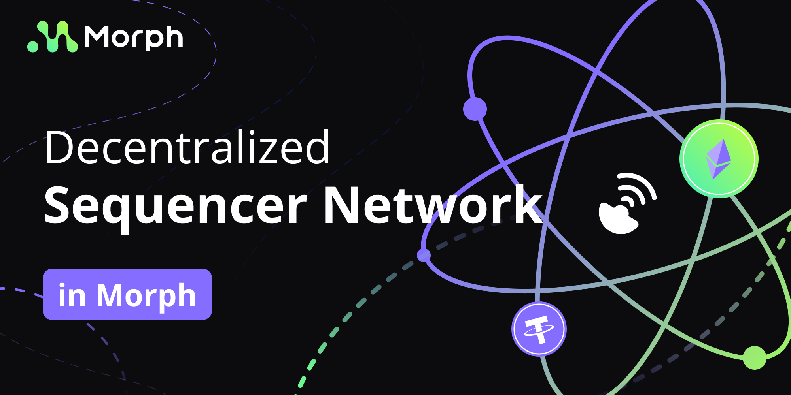
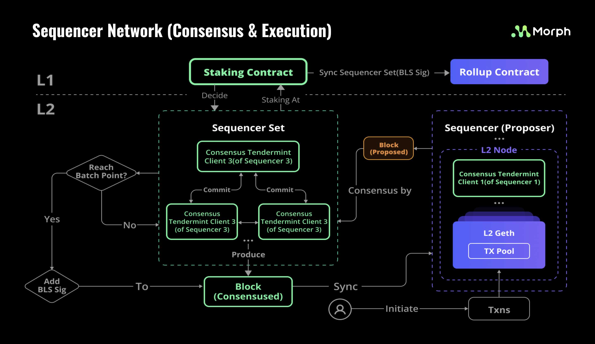

## The Importance of Decentralized Sequencers

### What is a sequencer and what does it do?

In traditional Layer 1 blockchain, transactions are packaged and processed by miners in proof-of-work systems or validators nodes in proof-of-stake systems. These entities earn the authority to package, sequence, and produce blocks either through the competitive task of computational mining or via staking-based elections.

However, many current Layer 2 designs employ a single role, unburdened by competition or staking costs, responsible for packaging and sequencing all Layer 2 transactions. This entity is known as the “sequencer”. Its duties extend beyond sequencing; it is also tasked with generating L2 blocks, periodically committing Layer 2 transactions and state changes to Layer 1, and addressing any potential challenges to its submissions.

Centralized sequencers present a challenge due to their sole dominion over the sequencing and packaging of Layer 2 transactions. This monopoly raises concerns, largely stemming from this centralized control.

### What are the problems with centralized sequencers?

#### Vulnerability of a Single Point of Failure

The efficient functioning of Layer 2 is intrinsically tied to the operation of the sequencer. If the sequencer stops working, transactions from all Layer 2 users will not be processed, effectively bringing down Layer 2 operations. The problem is magnified when a single entity controls the sequencer. Should the entity fail, the entirety of the Layer 2 is paralyzed, rendering the system vulnerable to a single point of failure. Therefore, centralized sequencers pose a significant risk to the stability of Layer 2.

#### Excessive Transaction Censorship

Centralized sequencers have the ability to reject user-submitted transactions, rendering them unprocessable — a blatant form of transaction censorship. Imagine a scenario where a centralized Layer 2 deliberately blocks transactions involving its governance tokens, which could spur panic and selling among users. These actions are entirely feasible for centralized sequencers.

Some solutions allow users to submit their intended transactions directly on Layer 1. However, this process is time-consuming, often taking several hours, and burdens users with equivalent Layer 1 gas fees. Therefore, this alternative does not fundamentally solve the problem.

In a decentralized sequencer framework on the other hand, should one sequencer decline a transaction, users can still relay it to alternative sequencers. The content of the next block is ultimately determined through consensus, ensuring no single entity can censor transactions based on personal interests.

#### Monopoly Over MEV

Because the sequencer can determine the order (or "sequence") of received transactions, it effectively has a monopoly over all Miner Extractable Value (MEV). In this scenario, users must bear any potential losses incurred by the sequencer’s exclusive control over MEV, necessitating an additional and unwarranted layer of trust in the sequencer.

Decentralized sequencers introduce a competitive dynamic among multiple entities aiming for MEV. This competition eliminates the monopoly of any single sequencer, mitigating the adverse effects of unchecked MEV on users.

## What's Morph's Approach to Decentralized Sequencers?

Morph stands apart from other Rollup projects due to the emphasis on establishing a decentralized sequencer network right from inception. This design was guided by the following core principles:

Morph stands apart from other Rollup projects due to the emphasis on establishing a decentralized sequencer network right from inception. This design was guided by the following core principles:

#### Efficiency: 

Morph is first and foremost an Ethereum scaling solution, focused on improved efficiency and cost reduction. Our solution must guarantee fast execution and transaction confirmation at Layer 2 while maintaining the highest possible level of decentralization.

#### Scalable and Manageable: 

The sequencer network’s design prioritizes ease of maintenance, expansion, and updating. If one network functionality requires maintenance, it should not disrupt the operation of other functionalities. In addition, the sequencer network should be adaptable and easily upgradable as new and more efficient solutions emerge.

### Solutions Formulated on These Principles

With these principles at the forefront, Morph’s sequencer network design includes:

*Modularity*: The structure emphasizes modular components that are loosely connected, allowing for swift upgrades or replacements. 

*Byzantine Fault Tolerant (BFT) Consensus*: Sequencers employ a BFT consensus for L2 block generation.

*BLS Signature for Batch Signing*: Sequencers sign a collective of L2 blocks using the BLS signature method. Then the L1 contract verifies this L2 consensus through the BLS signature.

:::tip
Why BLS signature?

If we use the current basic signature algorithm, such as ECDSA, in Ethereum, there will be a problem of excessive cost. This issue arises because the signature data needs to be submitted to the Layer 1 contract and requires payment of the corresponding cost. As the number of validators increases, this cost will also increase proportionally. By using BLS signatures, the cost of uploading signatures can be maintained at a constant level, unaffected by the gradual growth of the sequencer's quantity.
:::

### Architecture

Here is a simple illustration of the Morph decentralized sequencing network architecture.

#### Sequencer Set Selection

A complete Morph decentralized sequencer network consists of two parts:

- **Sequencer Set** : This forms the core group that provides sequencing services
- **Sequencer Staking Contract**: This contract facilitates the selection of the sequencer set via an election process. 
- 
Through the sequencer staking contract, members are elected into the sequencer set, where they collaboratively provide services for the Morph network. Periodically, the election results are synchronized to the Layer 1 Rollup contract. This synchronized data is utilized to obtain the BLS aggregate signatures of sequencer network participants for comparison and verification.

### Layer 2 Blocks Generation

Given Morph's modular design, each sequencer operates a consensus client that runs BFT to communicate with other sequencers.

Following the BFT consensus protocol, the selected sequencer extracts transactions from the mempool, constructs blocks, and synchronizes these blocks with other sequencers to undergo verification and voting. The end result is the generation of new Layer 2 blocks.

### Batching

Considering the costs of uploading to and validating signatures on Layer 1, sequencers will sign a batch of blocks with BLS signatures at designated checkpoints.

Post-signing, the designated sequencer forwards the collective batch of blocks to Layer 1 through its batch submitter component.

###Consensus Verification

The selected sequencer must submit to the Layer 1 contract:

- The aggregated BLS signatures
- The batch of transactions
- The consensus-determined state 

The Layer 1 contract will verify the submitted signature to confirm the transaction's consensus.

## Wrap up

- Morph builds a native centralized sequencer network based on BFT consensus.
- Through protocol and network optimization, Morph maximizes the scalability of Ethereum while ensuring decentralization.
- Based on BLS signatures, other participants in Layer 1 and Layer 2 can effectively verify the consensus results of Layer 2, ensuring the security provided by the sequencer network is confirmable at the Layer 1 level.

## Roadmap

**Stage 1**: Close beta test on testnet
**Stage 2**: Decentralized sequencer network live on mainnet
**Stage 3**: Open election of sequencer set
**Stage 4**: Share Morph's sequencer network with other rollups
