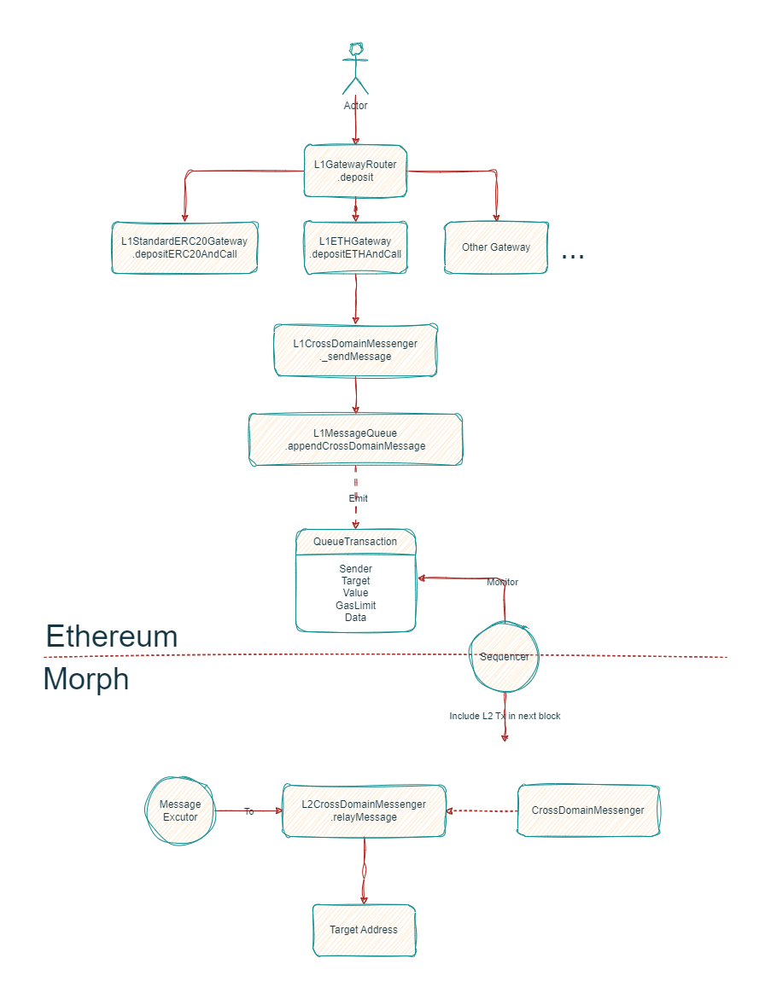
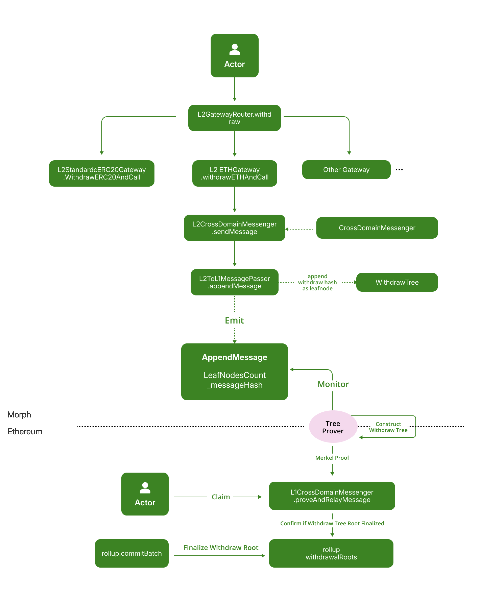

Although Morph is a Layer 2 solution built atop Ethereum, it remains a separate and distinct blockchain. Thus, it’s essential to establish a communication channel between Morph and Ethereum to facilitate the smooth transfer of assets and messages. The communication can occur in two directions: from Ethereum to Morph and from Morph to Ethereum.

## The Basics of Morph - Ethereum Bridge​


Transferring assets between Ethereum and Morph involves the following process:

- Asset Locking and Wrapping: To initiate the transfer, a user must lock their asset on the cross-layer bridge. When the lock is confirmed, Morph mints a Wrapped Token that represents the value of the locked asset, in a procedure referred to as a "deposit".

- Asset Reception: Following the minting, the user or intended recipient will receive the asset on Morph, reflecting the value of the originally locked asset. 

- Reverse Process: Conversely, to transfer assets back to Ethereum, the bridge can unlock the original asset on Ethereum by burning the Wrapped Token on Morph. This is referred to as "withdraw".

Furthermore, the bridge’s utility extends beyond asset transfers. It employs the same foundational principle for message transfers, enabling the conveyance of data payloads across two network layers.


## Understanding the Gateway


The Gateway serves as the primary entry point for users to interact with the entire bridge system. While the core process of transferring assets across layers still relies on message transmission, we recommend using the Gateway approach for efficient cross-layer transactions.

Catering to diverse cross-layer asset transfer needs, we have designed distinct Gateways such as the ETH Gateway, standard ERC20 Gateway, and others.

Furthermore, we have implemented the Gateway Router to call on different Gateways based on the type of assets you have. This facilitates seamless interaction with the Gateway Router contract.


| L1 Gateway Contract         | Description                                                      |
| ------------------------ | ---------------------------------------------------------------- |
| `L1GatewayRouter`        | The gateway router supports the deposit of ETH and ERC20 tokens. |
| `L1ETHGateway`           | The gateway to deposit ETH.                                      |
| `L1StandardERC20Gateway` | The gateway for standard ERC20 token deposits.                   |
| `L1CustomERC20Gateway`   | The gateway for custom ERC20 token deposits.                     |
| `L1WETHGateway`          | The gateway for Wrapped ETH deposits.                            |


| L2 Gateway Contract         | Description                                                      |
| ------------------------ | ---------------------------------------------------------------- |
| `L2GatewayRouter`        | The gateway router supports the withdraw of ETH and ERC20 tokens. |
| `L2ETHGateway`           | The gateway to withdraw ETH.                                      |
| `L2StandardERC20Gateway` | The gateway for standard ERC20 token withdraw.                   |
| `L2CustomERC20Gateway`   | The gateway for custom ERC20 token withdraw.                     |
| `L2WETHGateway`          | The gateway for Wrapped ETH withdraw.                            |


## Deposit (L1 to L2 message) 



### Constructing a Deposit Request Through the Gateway

A bridge request, whether it is for ETH, ERC20, or ERC721, is essentially a cross-layer message, which necessitates the initial construction of a message. 

Generally, the message structure remains consistent, especially for ETH & ERC20 Gateways.

Employing a token gateway compiles a standard token gateway message and relays it to the ```CrossDomainMessenger```.

### Passing the Message Through the CrossDomainMessenger


The ```CrossDomainMessenger``` serves as the core unit of cross-layer communication,
with corresponding messenger contracts on both Layer 1 and Layer 2.

For a deposit, the L1 messenger sends a message to the L2 messenger, akin to a contract call on Layer 1, which means custom messages (contract interactions) can be constructed to perform various types of cross-layer interactions.

### Executing the Message on Layer 2

The cross-domain message is delivered to the ```L1MessageQueueWithGasPriceOracle```, which then triggers an event called ```QueueTransaction```.

The Sequencer will monitor this event and include a Layer 2 transaction in its next block.


### How to make sure Sequencer doesn't fake a deposit transaction?

Sequencers may have the motivation to forge a non-existent deposit transaction, such as minting a large amount of Layer 2 tokens and transferring these to an address they own.

Morph prevents these risks with two measures:

Due to Morph’s decentralized Sequencer architecture, forging transactions would require control of at least two-thirds of the Sequencers, a challenging feat.

Morph's optimistic zkEVM framework allows challengers to detect such malicious behavior and initiate challenges to correct the misconduct.


A Layer 2 executor, holding the cross-layer message, interacts with the L2 messenger to execute the message, which may include transferring L2 ETH or ERC20 tokens to the recipient.


### Finalizing the Deposit Message

The completion of the deposit process involves more than just executing the request on Layer 2. There is a possibility that the Layer 2 execution and its corresponding state update could be reverted due to incorrect batch data being identified through the challenge process.

Therefore, a deposit request is only considered complete once the corresponding batch of the deposit execution transaction is finalized.

Typically, this follows a simple workflow:

- The deposit execution transactions are compiled into a batch and submitted to Layer 1 by batch submitters. 

- Following the challenge period, valid batches are finalized by subsequent batch submissions using ```rollup.commitBatch```. 

- During finalization, the ```L1MessageQueueAndGasPriceOracle``` removes(pop) the deposit message from the queue, marking the completion of  the deposit process.


## Withdraw (L2 -> L1 message) 



### Finalizing a Withdrawal

Unlike Deposits, a withdrawal request must undergo 2 processes for execution:

1. Prove that a withdraw request actually happened on Layer 2 by verifying a Merkle tree proof against the withdrawal tree root committed by sequencers.

2. Wait for the challenge period to end and finalize the withdraw tree root, addressing the risk of sequencer submitting incorrect batch data, including the withdraw tree root.

Typically, these 2 processes happen at the same time. Once the withdraw tree root is finalized, users can call the ```proveAndRelayMessage``` method within the ```L1CrossDomainMessenger``` contract to execute the withdrawal message.

```solidity
function proveAndRelayMessage(
        address _from,
        address _to,
        uint256 _value,
        uint256 _nonce,
        bytes memory _message,
        bytes32[32] calldata _withdrawalProof,
        bytes32 _withdrawalRoot
    )

```

This function serves two primary purposes:

1. It checks if the withdraw tree root associated with this message has been finalized through the rollup contract.
2. It verifies whether the withdraw request actually occurred by validating the provided Merkle proof.

Upon successful completion of both processes, this method will execute the corresponding action, such as releasing the user's ETH on Layer 1 for a standard ETH withdrawal request.


### Understanding the Withdraw Tree

Withdrawal actions involve interacting with L1 assets/contracts as a result of a Layer 2 transaction. Consequently, it’s imperative to verify the existence of a Layer 2 transaction that triggers a withdrawal request, in a manner that is verifiable on Layer 1.

To achieve this, we introduce a structure known as a Withdraw Tree, which records every L2 withdrawal transaction within a Merkle tree. Thus, a Merkle tree's properties can be leveraged to confirm a withdrawal request’s occurrence.

The term Withdraw Tree refers to an append-only Sparse Merkle Tree (SMT) with leaf nodes that capture information on assets being transferred out of the network.
Each leaf in the Withdraw Tree, known as a Withdraw leaf, falls into two categories: type 0 for recording asset(s) information and type 1 for recording messaging information.

A withdraw leaf, in particular, is a Keccak256 hash of the ABI encoded packed structure with cross domain message.

The Withdraw Tree is instrumental in cataloging withdrawal transactions and ascertaining the legitimacy of withdrawal requests.

Morph has pre-deployed a Simple Merkle Tree contract dedicated to constructing the Layer 2 withdraw tree.

This tree incorporates three methods:

1. ```getTreeroot``` - Retrieves the current tree's root hash.
2. ```appendMessageHash``` - Appends a new leaf node to the tree.
3. ```verifyMerkleProof``` - Verifies if a leaf node exists in the tree, indicating the validity of the bridge request it represents.

### Understanding the Challenge Period & Batch Finalization

The Optimistic zkEVM architecture mandates that each L2 transaction be submitted to Layer 1 and undergo a challenge period before finalization.

This process is vital to validate the Layer 2 state, eventually validating the authenticity of the withdraw request.

The withdraw tree root, integral for withdrawal request verification, is also submitted by sequencers once the challenge period, batches, and states have been finalized.

## Cross-layer (Bridge) Errors

With the design of cross-layer bridges, the cross-layer message for deposits needs to be executed and have its Layer 2 states updated. Sending a cross-chain request successfully does not guarantee its successful execution on L2.

Prior to this, there is a possibility of the cross-layer message failing during execution on Layer 2. 
This section outlines the potential scenarios and solutions for handling failed cross-layer deposit messages.

### Cross-layer (Bridge) Failure Scenarios:
Two primary types of failures can occur in cross-layer (bridge) communications:

1. Gas Failure: Cross-layer messages sent from the L1 to the L2 might fail during execution on the L2 due to limitations in gasLimit or code logic. 

2. Skipped Message: Some data executions may trigger overflows in the circuits of L2 nodes, leading to the omission or skipping of cross-layer messages. 

### Handling Cross-layer (Bridge) Failures:

For Gas Failures:

- When the ```L1CrossDomainMessenger``` contract on L1 dispatches a cross-layer message, it records the corresponding message hash but does not incorporate the gasLimit in this record. Post-execution on L2, the ```L2CrossDomainMessenger``` performs an equivalent calculation, storing the contract call result in ```mapping(isL1MessageExecuted)```. This measure prevents multiple executions of the same message and facilitates the adjustment of gasLimit parameters for replaying failed messages.

- Replay Message: If gasLimit is insufficient, causing a failed execution on the L2, a new cross-layer message with a revised gasLimit parameter can be sent by calling ```L1CrossDomainMessenger.replayMessage```.

For Skipped Messages:

- Messages dropped due to potential circuit overflow on the L2 are skipped and not executed. Custom cross-layer calling contracts need to implement the 
```onDropMessage``` method to consider such cases.

- The gateway contract includes the onDropMessage method, designed to refund the initiator of the cross-layer message.

- Calling ```L1CrossDomainMessenger.dropMessage``` discards the cross-layer message and triggers the onDropMessage method in the originating contract, passing the transaction's value and message as msg.value and method parameters, accordingly.
