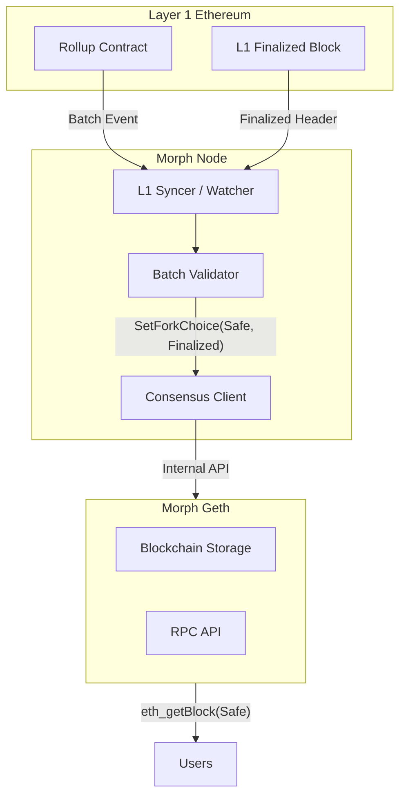

## 1. Overview

To align with standard Ethereum semantics (Geth/Engine API) and provide deterministic transaction status guarantees for dApps and bridges, Morph L2 fully supports `latest`, `safe`, and `finalized` block tags at the RPC layer. This document outlines the semantics, system architecture, storage updates in Geth, and consensus synchronization logic in the node.

## 2. State definitions

In Morph’s L2 rollup lifecycle, block states progress as follows:

| Tag | Semantic definition | Trigger condition | Finality level | Reorg risk |
| --- | --- | --- | --- | --- |
| Pending | Mempool state; transaction accepted but not yet in a block | Transaction enters the mempool | None | Very high |
| Latest | L2 local tip; sequencer produced and broadcast the block | Block proposed by sequencer | Soft confirmation | Exists (L2 reorg) |
| Safe | Data availability submitted; batch data included in the L1 contract | Batch submitted to L1 | Hard confirmation | Very low (L1 reorg only) |
| Finalized | L1 finalized the block containing the batch | L1 block finalized | Total finality | None (irreversible) |

> **Note:** To minimize the impact of shallow L1 reorgs on the L2 `safe` tag, Morph applies an N-block delay (recommended: N = 10 L1 blocks) before marking a block as `safe`.

## 3. System architecture

Morph separates control and storage:

- **Morph Node (Consensus layer):** Monitors L1, verifies batches, and decides fork choice.
- **Geth (Execution layer):** Stores state and serves RPC queries.



## 4. Geth implementation (execution layer)

Morph Geth follows the mainstream design (e.g., Optimism/Geth), using in-memory atomic storage to avoid extra DB I/O.

### 4.1 Core data structures (`core/blockchain.go`)

Introduce atomic pointers in `BlockChain` for concurrent-safe access to `safe` and `finalized` headers.

```go
type BlockChain struct {
    // ... existing fields
    currentSafeBlock      atomic.Pointer[types.Header]
    currentFinalizedBlock atomic.Pointer[types.Header]
}

// Setter for Node
func (bc *BlockChain) SetSafeBlock(header *types.Header) {
    bc.currentSafeBlock.Store(header)
}

func (bc *BlockChain) SetFinalizedBlock(header *types.Header) {
    bc.currentFinalizedBlock.Store(header)
}

// Getter for RPC
func (bc *BlockChain) CurrentSafeBlock() *types.Header {
    return bc.currentSafeBlock.Load()
}

func (bc *BlockChain) CurrentFinalizedBlock() *types.Header {
    return bc.currentFinalizedBlock.Load()
}
```

### 4.2 RPC interface adapter (`eth/api_backend.go`)

Resolve block tags to the in-memory pointers before falling back to standard lookups.

```go
func (b *EthAPIBackend) HeaderByNumber(ctx context.Context, number rpc.BlockNumber) (*types.Header, error) {
    switch number {
    case rpc.PendingBlockNumber:
        block, _, _ := b.eth.miner.Pending()
        return block.Header(), nil
    case rpc.LatestBlockNumber:
        return b.eth.blockchain.CurrentBlock().Header(), nil
    case rpc.SafeBlockNumber:
        // Return in-memory Safe Block; handle nil case gracefully
        return b.eth.blockchain.CurrentSafeBlock(), nil
    case rpc.FinalizedBlockNumber:
        return b.eth.blockchain.CurrentFinalizedBlock(), nil
    }
    // Standard lookup
    return b.eth.blockchain.GetHeaderByNumber(uint64(number)), nil
}
```

### 4.3 Internal control API (`internal/ethapi/api.go`)

Expose a private interface for the node to set fork choice.

```go
// SetForkChoice updates the safe and finalized blocks
func (api *l2ConsensusAPI) SetForkChoice(safeHash, finalizedHash common.Hash) error {
    // Logic: Verify Hash exists locally -> Get Header -> Update Pointer
    if safeHash != (common.Hash{}) {
        if header := api.eth.BlockChain().GetHeaderByHash(safeHash); header != nil {
            api.eth.BlockChain().SetSafeBlock(header)
        }
    }
    // Same logic for Finalized...
    return nil
}
```

## 5. Node implementation (consensus layer)

The node enforces data availability verification before promoting a block to `safe`.

### 5.1 Validation and sync loop

1. **Listen to L1 events:** Scan L1 from height `H_L1sync`. Track `BatchCommitted` events (with `L2BlockNumberRange` data) and the L1 finalized height. Apply an L1 safety buffer when consuming events (e.g., `CurrentL1Height − EventL1Height > 10`).
2. **Batch reconstruction and verification:**
   - Parse batch data to derive the L2 transaction list, including deposit transactions initiated on L1.
   - Fetch the corresponding L2 blocks from local Geth.
   - Verify `Hash(Local_L2_Txs) == Hash(Batch_Derived_Txs)`.
   - Optionally verify `StateRoot` and `WithdrawRoot` at the batch end block match local execution.
3. **Drive state updates:**
   - On successful batch verification, call `SetForkChoice(safe=BatchEndBlockHash)`.
   - When the L1 block containing the batch is finalized, call `SetForkChoice(finalized=BatchEndBlockHash)`.

### 5.2 Bootstrap and recovery strategy

Because safe/finalized pointers are in-memory only, the node restores them on startup:

- Initialize with nil pointers in Geth.
- Query the L1 contract for the most recently submitted batch.
- If the local L2 chain is synced to that batch end block, immediately call `SetForkChoice` to restore state.
- Enter the normal validation loop described above.

## 6. Interface compatibility list (RPC)

Standard Ethereum RPC methods must accept `safe` and `finalized` block tags:

- `eth_getBlockByNumber`, `eth_getHeaderByNumber`
- `eth_getBalance`, `eth_getTransactionCount`, `eth_getStorageAt`, `eth_getCode`
- `eth_call`, `eth_estimateGas`, `eth_getProof`
- `eth_getLogs`, `eth_getBlockReceipts`
- `debug_traceBlockByNumber`
