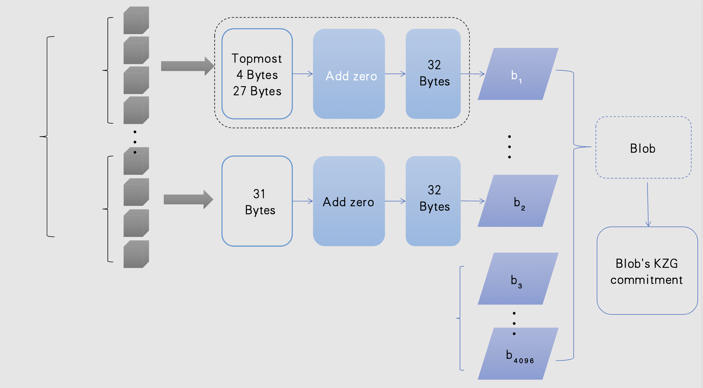

---
author:
- Morph
bibliography:
- ref.bib
date: February 2024
title: Morph's Compatible and Practical Proof Aggregation Scheme Under
  EIP-4844
---
<!--
<link rel="stylesheet" type="text/css" href="style.css"> 

import 'katex/dist/katex.min.css';

-->

## Introduction to EIP-4844

In EIP-4844, there is a new transaction type called
"Blob-carrying transaction". This type of transaction contains a large
quantity of data which are not accessible through the EVM execution
layer. However, for these specific data, their commitment could be read
from the execution layer in some particular form. The purpose is to make
the format of these transaction data fully compatible with the one used
in the sharding proposal.

From a mathematical view, each blob is a vector comprised of 4096 finite
field elements. In EIP-4844, this finite field is chosen as the scalar
field of the elliptic curve BLS12-381. To commit this blob,
this vector will first be interpolated into a polynomial with a degree
of 4095. Concretely, supposing $i$ ranges from 0 to 4095 and $  \omega  $ is
the 4096-th primitive root of unity in the BLS12-381 scalar field, the
$i$-th coordinate could be evaluated as ${\omega}^i$. With the general
computational logic of KZG commitment on this
polynomial. We can get the blob commitment from Ethereum and verify it.

EIP-4844 will play a pivotal role in the rollup procedure. Before
EIP-4844, the transaction data was stored as calldata and public inputs,
which cost a lot of gas. With EIP-4844, the raw transaction data will be
submitted to the blob and stored as \"Blob-data\" in the consensus
layer. Additionally, these blob data could be thrown away after a
certain amount of time. With EIP-4844, the data availability could be
satisfied during this time, ensuring the completeness of layer 2.

|          Constant Name          |      Value        |             Description              |
|:--------------------------:|:------------:|:-----------------------------:|
|        BLOB_TX_TYPE        | Bytes1(0x03) |        New Txn Type         |
|  BYTES_PER_FILED_ELEMENT   |      32      | Element 32 bytes |
|  FIELD_ELEMENTS_PER_BLOB   |     4096     |    Blob's Capacity     |
| VERSIONED_HASH_VERSION_KZG | Bytes(0x01)  |              Version  |

# Equivalent Proof of KZG Commitment

Now we will focus on ZK-rollup procedure under EIP-4844. We need to
check following two relations under EIP-4844: the consistency between
blob commitment and the blob data , the consistency between blob data
and the transaction data. According to the current development state of
Ethereum, the existing precompiled contracts only support the pairing
operation (ecPairing) and group operations(ecMul, ecAdd) about BN254.
However, the elliptic curve used in EIP-4844 is BLS12-381. When
implementing the zk-circuit, this will cause complex wrong-field
operations: we will need to express the operations on BLS12-381 as
operations on BN254. To address this problem, we will utilize the
Schwartz-Zippel lemma and the finiteness of the commitment. The
commitment to the blob data will be converted to a random challenge on
the evaluation of an arbitrary point of the interpolated polynomial.\
There are three parts of the equivalent proof:

-   Prove that the interpolated polynomial(finite field elements) stored
    in the blob data indeed represents exactly the raw transaction data
    by circuits.

-   Prove the interpolated polynomial passes the challenge of evaluation
    on a random point by circuits.

-   Prove the above two parts (KZG commitment and circuit's public
    inputs) meet the expected constraints through the precompiled
    contract (point_evaluation_precompile()) in EIP-4844.

## Equivalence of Blob Data and Raw Transaction Data

As for ZK circuits, we begin by designing the first part of the above
with an example of one blob. In the terminology of zero-knowledge, the
circuit's public inputs have two components. One is the raw transaction
data, the other is the 4096 elements in the target finite field. The
constrained computational logic here is the encoding procedure, which
transfers the transaction data to the blob data. We briefly explain our
encoding scheme below:

-   We encode the field elements as big-endian uint256(additionally,
    within the BLS12-381 modulus range), transferring the 31-byte data
    into 32-byte data. To support the follow-up blob-sharding
    verification, we will divide the raw transaction data in one batch
    into chunks.

-   For encoding in each chunk, we produce one 31-byte data denoted as
    $D$. Firstly, the total length of the input data of this chunk,
    would be stored in the topmost 4 bytes of $D$. Secondly, we embed
    the left 27 bytes of $D$ with the actual data of this chunk from its
    beginning. After we get $D$, we embed a 1-byte prefix of zero to
    produce the first field element of this chunk's respective blob,
    which is 32-byte long.

-   For the left data of the chunk, we embed a one-byte zero in each
    31-byte data flow and save this 32-byte data as one field element.
    When the last data doesn't have enough length, we will first embed
    it as 31-byte and do the same thing as above.

The original data with the length of a batch is split into multiple
sharding data with the length of a chunk, stored as the blob data in
each chunk. This encoding scheme is better for follow-up aggregation
compared to previous schemes.

## Verification of the Interpolated Polynomial's Evaluation

To keep the performance and lower the complexity of wrong-field
arithmetic operations, we would need to clarify that the interpolated
polynomials are equal both in the circuit and in the contract using a
practical method. The harder one is the evaluation in the circuit: one
possible solution is to use the Barycentric interpolation
formula which only relies on non-native
multiplications and divisions.

When considering a specific blob, the public inputs of the circuit
contain 4096 scalar field elements, the challenge point x and an
evaluation result y. 

For a blob containing 4096 scalar field elements,

$$
Blob = \left[b_0, b_1, \cdots, b_{4095}\right]
$$

Formula:

$$
p(x) = \frac{x^N -1}{N} \sum f_i\times (\frac{\omega^i}{x-\omega^i})
$$

the Barycentric
interpolation formula could be written as:

$$
p(x) = \frac{x^{4096}-1}{4096}\sum_{i=0}^{4095} b_i \times (\frac{\omega^i}{x-\omega^i})
$$

Below we give our computational logic to be constrained:

-   By Fiat-Shamir transformation, a pseudo-random challenge point $x$
    is generated, and there is a consistency check using Poseidon Hash
    in the circuit.

-   Check if $x \in w^{i}, i \in [0, 4095]$, and compute the Barycentric
    formula if satisfied

-   Check the above result equals y

### Aggregation Circuit

In our encoding scheme, each 32-byte transaction data could be expressed
as one finite field element of BLS12-381 scalar field. However, each raw
transaction data's length may not be exactly the multiple of 32 bytes,
and its information might be divided into two elements, which are not
essentially right in the same blob. Below we list the actual problems we
may meet in implementation:

-   The transaction data in one chunk may not be exactly expressed as
    integral finite field elements.

-   Some transaction data after encoding might be divided into two
    separate blobs.

-   A chunk may only contain a small amount of raw transaction data,
    which corresponds to much fewer finite field elements than 4096
    finite field elements in the standard.

To address the first problem, we would embed zeros to each chunk's
transaction data, ensuring they are multiples of 32 bytes after
encoding.\
As for the second problem, we will choose to let the last transaction
data be encoded into the first element of the next blob. and we could
employ a way for KZG commitment's multi-open, to verify these two
blobs(or more) in an aggregated style.\
When it comes to the third problem, we need to carefully constrain our
encoding schemes with more information for utilizing our aggregated
evaluation circuits:

-   We revise the storage of the batch-length information as the storage
    of the chunk-length information, in the topmost few bits of each
    chunk's raw data before encoding.

-   For each chunk, we add two extra indices' constraints as well as the
    encoding consistency check: One is the index of the chunk's first
    transaction, and the other is the index of the chunk's last
    transaction.

With the above description, we briefly explain our aggregated evaluation
methods below. 

In the scenario, a blob's finite field elements are
comprised of multiple chunks' transaction data encoding, in a total
number of 4096 finite field elements. Supposing there are $k$ chunks,
and the $i$-th chunk corresponds to the following finite field elements:

$$
b_m,b_{m+1},b_{m+2},b_n
$$

We could first compute:

$$
y_i^{\prime}=p_i^{\prime}(x)=\sum_{i=m}^n b_i \times\left(\frac{\omega^i}{x-\omega^i}\right)
$$

Take this one blob and its corresponding $k$ chunks for example, we
could utilize the above equation to aggregate the chunk-proof. Firstly
we compute 

$y_1^{\prime}, y_2^{\prime}, \cdots, y_{k}^{\prime}$
 
in the above way, and aggregate them in the same blob:

$y=\frac{x^{4096}-1}{4096} \sum_{i=1}^{k} y_i^{\prime}$

### Verification On the Smart Contract

Thanks to the new precompile that EIP-4844 brings, users can open the
commitment to the blobs from smart contracts. The consistency check
between the blob data and the commitment could be turned into the check
between the challenge point $x$, its evaluation $y$, and the Blob's
commitment. This part will be verified through the smart contract by
checking $p(x) = y$.

## Summary

Layer-2 plays an important role in the scaling roadmap of Ethereum.
However, they incur the doubt of security or poor performance. Based on
a solid mathematical ground, ZK-rollup can achieve high-level security
with cost on its proof generation and verification. By designing
advanced algorithms and using better hardware, the former could be less
burdened; While for the latter one, the blockchain itself is more
involved.\
Our proposal has the following three advantages under EIP-4844:

-   Compatible: Our scheme describes a way to fill in the blob data,
    with modified encoding methods from batch-level to chunk-level. So
    it is very compatible with the existing zkEVM circuits and EIP-4844.

-   Practical: Only operations over BN254 other than over BLS12-381 in
    EIP-4844 is supported by precompiles, so there will be many
    difficulties in the implementation and performance to verify KZG
    commitment. By using Barycentric formula, we reduce the wrong-field
    operations to an affordable computation.

-   Aggregatable: By aggregation, we could decrease the number of proofs
    as well as the on-chain gas cost of the verification. Taking
    advantage of our design at a chunk-aggregation level, we could
    optimize the aggregation as much as possible under EIP-4844.

EIP-4844 is an ultimate catalyst that will push the progress in
ZK-rollups, while there would also be many concrete problems to handle.
In this article, we propose and describe our practical solutions for the
circuit design with EIP-4844. In pursuit of a cheaper and safer
transaction environment, the Morph team keeps exploring new technologies
and contributing more to the community.
