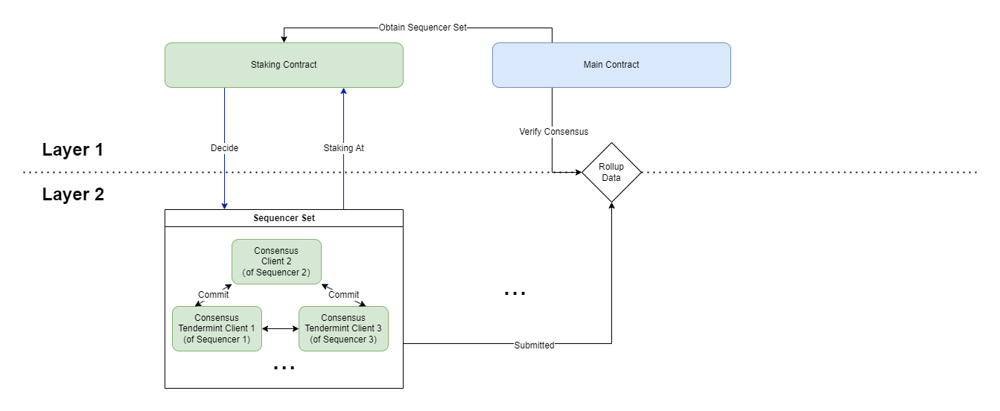
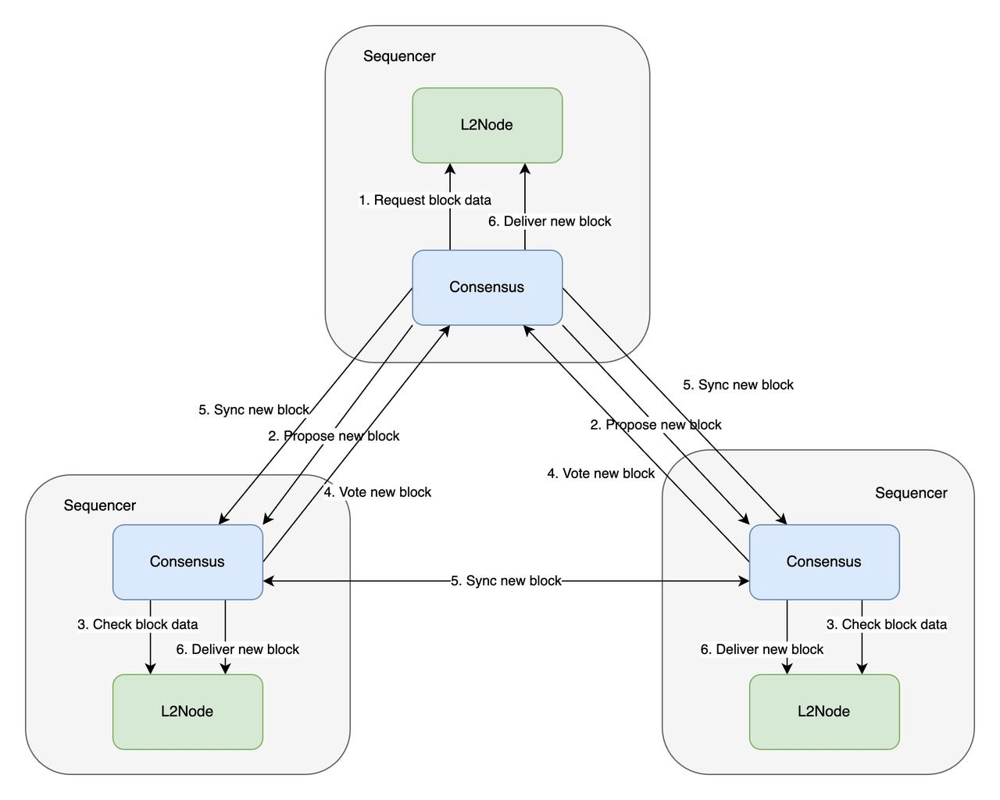

## Why do we need decentralized sequencers?

### What is sequencer & What does it do?

In classical Layer 1 blockchains, transactions are packaged and processed by miners (or validator nodes in POS) who gain the power to package, sequence, and produce blocks through computational power competition or stake-based elections.

However, in current Layer 2 designs, there often exists a single role responsible for all the packaging and sequencing of Layer 2 transactions, and this process lacks competition or staking costs.

This role is known as the sequencer, who not only sequences and generates L2 blocks but also periodically commits Layer 2 transactions and state changes to Layer 1, addressing any potential challenges to the states it submits.

The main issue with centralized sequencers arises from their monopoly over the power to sequence and package Layer 2 transactions. The problems that arise from this power largely revolve around this characteristic.

### What are the problems with centralized sequencers?

#### Potential single point of failure

The operation of the sequencer directly affects on Layer 2 activity. If the sequencer stops working, it will prevent the processing of transactions from all Layer 2 users, essentially causing Layer 2 to be down.

When a single entity is running the sequencer, any failure on their part will lead to the entire Layer 2 being paralyzed, resulting in a single point of failure. Therefore, centralized sequencers pose significant potential risks to the operation of Layer 2. 

#### Excessive transaction censorship

Centralized sequencers possess the authority to reject user-submitted transactions, causing these transactions to be unprocessable, essentially constituting a form of censorship. Imagine a scenario where a centralized Layer 2 refuses to process any transactions involving their governance tokens (even though this might cause more panic and selling among users). This is entirely feasible for centralized sequencers.

In some schemes, users can submit the transactions they intend to execute on Layer 1, but this process often takes several hours and incurs equivalent Gas Fees on Layer 1. Therefore, this does not fundamentally solve the problem.

On the other hand, with decentralized sequencers, even if a single sequencer refuses to include a transaction, users can still submit it to other sequencers, and the content of the next block is ultimately determined through consensus, without any single entity being able to censor transactions according to their own interests. 

#### Monopoly on MEV

Since the sequencer has the freedom to order (or "sequence") the received transactions, it effectively monopolizes all the MEV (Miner Extractable Value). In the case of a single centralized sequencer, users will have to bear any potential losses caused by its control over MEV, relying on an additional assumption of trust in the sequencer.
Decentralized sequencers, on the other hand, introduce a game among multiple parties to vie for MEV, eliminating the monopoly status of a single sequencer and reducing the impact of uncontrolled MEV on users.

## What's Morphism's solution?

Unlike most Rollup project，Morphism has decentralizing sequencer network setup at the beginning. 
When designing this system, we followed the following principles.

### The Principles

#### Efficiency
Morphism is first and foremost an Ethereum scaling solution, aiming to improve efficiency and reduce costs. Our solution must ensure fast execution and confirmation of transactions at the Layer 2 level while maintaining decentralization to the maximum extent possible.

#### Layer 1 Level Safety

Merely decentralizing the Sequencer at the Layer 2 level does not fully address the potential security implications of a single Sequencer. In a centralized design, Layer 1 contracts and other Layer 2 nodes (such as Layer 2 validation nodes and full nodes) can only obtain blocks and state information from a single Sequencer.

Even after decentralizing the Sequencer, there may still be issues because Layer 1 contracts and other Layer 2 nodes do not have an effective way to confirm that the information they are synchronizing has undergone consensus. The Sequencer may still propagate incorrect information to other nodes.

Our design requires Layer 1 to obtain data and state from multiple independent roles (especially roles outside of the Sequencer) and be able to validate this data against a unified standard to determine if it has undergone consensus within the Sequencer network.

#### Scalable and Manageable
  
The design of the Sequencer network should be easy to maintain, expand, and upgrade. When a functionality in the network needs maintenance, it should not affect the normal operation of other functionalities. At the same time, when new and more efficient solutions emerge, the Sequencer network should have sufficient flexibility to be upgraded, allowing the entire system to stay updated.
 
#### Solution based on the principles：
Based on the above design principles, the design of the sequencer network involves the following key points:
1. Modular design, where the components are independent of each other and can be upgraded or replaced quickly.
2.  For L2 consensus, the BLS aggregated signatures of the sequencers in the network are used to identify the consensus result. The L1 contract verifies the consensus existence based on the sequencer set it maintains.
3. The sequencers use a Byzantine Fault Tolerant (BFT) consensus algorithm and process to ensure efficiency and security.

:::tip
**Why BLS signature?** 

If we use the current basic signature algorithm, such as ECDSA, in Ethereum, there will be a problem of excessive cost. This issue arises because the signature data needs to be submitted to the Layer 1 contract and requires payment of the corresponding cost. As the number of validators increases, this cost will also increase proportionally. By using BLS signatures, the cost of uploading signatures can be maintained at a constant level, unaffected by the gradual growth of the sequencer's quantity.
:::

### Architecture

Here is a brief architecture of the Morphism decentralized sequencing network.

#### Sequencer Set Selection

A complete Morphism decentralized sequencer network consists of two parts:

- Sequencer Set
- Sequencer Staking Contract

The sequencer staking contract will determine the composition of the sequencer set through elections, and the selected sequencers will collectively provide services for the network.

Simultaneously, the election results will be periodically synchronized to the Layer 1 Rollup contract, which can be used to obtain BLS aggregate signatures of sequencer network participants for comparison and verification.

#### Produce Layer 2 Blocks
In particular, leveraging Morphism's modular design, each Sequencer will run a consensus client implementing BFT to communicate with other Sequencers.

The Sequencer will follow the BFT consensus process. The selected sequencer will extract transactions from the mempool to construct blocks and synchronize these blocks with other sequencers for verification and voting. Ultimately, it will generate new Layer 2 blocks.

#### Generate Batch

Considering the cost of uploading signatures to Layer 1 and the cost of validating signatures on Layer 1, sequencers will perform the corresponding BLS signatures on multiple blocks, i.e., a batch, at designated checkpoints to ensure that the scalability goal is not compromised.

Once the signing is completed, the selected sequencer will submit these blocks as a batch to Layer 1 through its batch submitter component.

For more detail on how the batch is generated, please refer to the [rollup](../../how-morphism-works/general-protocol-design/1-rollup.md) section.

#### Consensus verification

The Sequencer responsible for constructing blocks needs to submit the aggregated BLS signatures, transaction batch, and state acquired from consensus to the Layer 1 contract. The Layer 1 contract will verify this signature to confirm the transaction's consensus.

Simultaneously, other participants in Layer 2 networks, such as full nodes and archival nodes, can also verify transactions by validating this signature when synchronizing transactions through consensus.

### Wrap up

- Morphism builds a native centralized sequencer network based on BFT consensus.
- Through protocol and network optimization, Morphism maximizes the scalability of Ethereum while ensuring decentralization.
- Leveraging BLS signatures, other participants in Layer 1 and Layer 2 can effectively verify the consensus results of Layer 2, ensuring that the security provided by the Sequencer Network is at Layer 1 level.

### What's on the Roadmap?

- Decentralized Sequencer Network Live

- Open election of sequencer network

- Shared Sequencer Network

