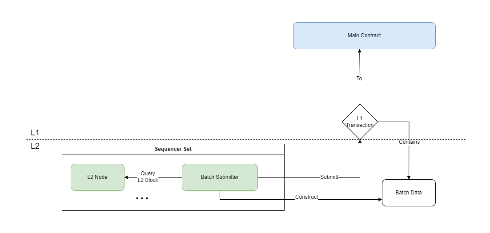

:::info

As the foundation of a Layer 2 project, the "Rollup" process refers to the process in which Layer 2 packages L2 transactions into batches and submits them to L1 along with the new L2 Global State. 

Within [Morphism's architecture](../2-morphism-modular-design.md), this process is carried out by the Sequencers' batch submitter components.

:::

## Construct the batch

Sequencer's L2 Node will produce L2 Blocks based on consensus results and update the L2 local state. Batch submitter will be required to query from L2 node to obatin the newest L2 blocks.

Then batch submitter will need to reconstructe the L2 blocks:

- Transactions : All the transactions within the blocks
- Blockinfo : Each blocks important information

Finally,batch submitter will construct the batch, each Batch contains:

- lastBlocknumber : The block number of the last block within the batch
- Transactions : Encodes of all the transactions within the batch
- BlockWitness : Encoides of block's blockinfos, this is for zkProof
- PreStateRoot : stateRoot that before apply the batch
- PostStateRoot : stateRoot that after applying the batch
- WithdrawRoot : L2 withdraw merkle tree root
- Signature : Batch BLS signature

:::info

Blockinfo is needed because morphism leverage zk technology as a way to prove the correctness of the submitted batch data, it will be use as the ZK Proof witness.

:::

## Submit batch data to L1 main contract

The batch submitter will eventually send an Ethereum transaction from its Layer 1 account to Morphism's main contract.

The batch data will be contained within this transactions calldata.

:::info

Based on the development process of ERC-4337, future batch data will be likely put into the new blob structure to reduce cost.

::: 

Once submitted and transcation is confirmed on Ethereuem, validator nodes could use the transactions within the batch data to reconstruct and verify the validity of sequencers' submission.

If the submission is proven to be valid under the rules of morphism's [responsive validity proof](../responsive-validity-proof/1-overview.md), L1 main contract will updated its local stateroot with the submitted "PostStateRoot", hence all the transactions within the batch is finalized.
