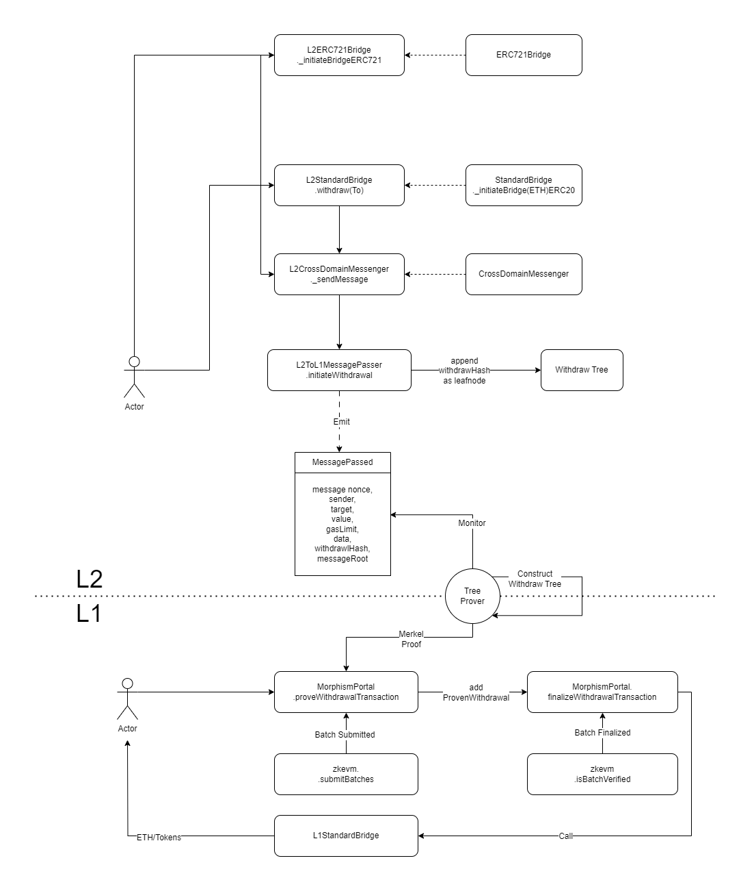

Although as a Layer 2, Morphism is built on top of Ethereum, these two are still separate and distinct blockchains.

Therefore, we need to construct a communication channel for Morphism and Ethereum to allow a smooth transfer of assets and messages.

Typically, there are two ways: Ethereum to Morphism and Morphism to Ethereum.

Now let's dive into how cross-layer communication are achieved in Morphism.

## The basic idea of the Morphism <=> Ethereum Bridge

To transfer an asset between Ethereum and Morphism, a user must lock the asset in the cross-layer bridge. When the lock is confirmed, Morphism will then mint a Wrapped Token that represents an equivalent value of the locked asset. This process is also called "deposit".

Once the minting process is finished, the user or intended recipient can claim the asset in Morphism.

Conversely, the bridge can also unlock the original asset in Ethereum by burning the Wrapped Token. This process is also called "withdraw".

Furthermore, the bridge will not only be utilized to process asset bridging, as token transfer is essentially the same as message transfers. The bridge can also be utilized to process cross-layer message bridging.

This means that data payloads can be sent from one network to another using the same logic.


## Deposit (L1 to L2 message) 


### Construct a deposit request through Standard Bridge (Optional)

Any bridge request, ETH bridge, ERC20/721 bridge is essentially a cross-chain message, thus, we need to construct a message first. But most of the time, the message would look the same, especially for ETH & ERC20 token bridge.

Using a standard bridge will build a typical token bridge message and pass it to ```CrossDomainMessenger```.

Any bridge request, whether it is for an ETH bridge or an ERC20/721 bridge, essentially involves a cross-chain message. Therefore, we need to construct a message first. However, most of the time, the message will appear the same, particularly for an ETH and ERC20 token bridge.

Using a standard bridge will create a typical token bridge message and pass it to the ```CrossDomainMessenger```.

### Pass the message through CrossDomainMessenger

```CrossDomainMessenger`` are the basic unit of the cross-layer communication.

There are both messgeners on Layer 1 and Layer 2, in the case of deposit, L1 messenger will send message to L2's.

The interaction will basically like one contract calling another on Layer 1, so you can create your own message (contract interactions) to perform any form of cross-layer interactions.

### Execute the message on Layer 2

The cross-domain message will pass to ```MophismPortal``` to generate an event called TransactionDeposited.

Sequencer will monitor this event and include the Layer 2 transaction in its next block.

Based on the cross-chain message it holds, there will be a Layer 2 executor to interact with L2 messenger to execute the message, including transferring L2 ETH or ERC20 tokens to the receiver.

## Withdraw (L2 -> L1 message) 



Most of the withdrawal process is simply the reverse of the deposit process, but there are two main differences here.

### Withdraw Tree 

Withdraw means interacting with L1 assets/contracts based on a Layer 2 transaction, so we have to make sure there is actually a Layer 2 transaction that initiates a withdraw request. And this needs to be verifiable on Layer 1.

To achieve this, we introduce a withdraw tree, which will record every L2 withdraw transaction into a Merkle tree. Thus, we can leverage the Merkle tree's features to verify if a withdraw request has actually occurred.

The Morphism bridge utilizes a special Merkle Tree called Withdraw Tree to achieve this.

The term Withdraw Tree refers to an append-only Sparse Merkle Tree (SMT) whose leaf nodes record information about assets being transferred out of the network. 

A leaf of a Withdraw Tree is referred to as a Withdraw leaf. Exit leaves are classified into two types: type 0 for recording asset(s) information and type 1 for recording messaging information.

An exit leaf, in particular, is a Keccak256 hash of the ABI encoded packed structure with the following parameters:

Morphism pre-deployed a Simple Merkel Tree contract to construct the Layer 2 withdraw tree.

The withdraw tree are used to store withdraw transactions and verify if a withdraw request is valid

This tree have 3 methods:

1. ```getTreeroot``` - return current tree's root hash
2. ```appendMessageHash``` - append a new leaf node to the tree
3. ```verifyMerkleProof``` - verify if a leaf node existed in the tree (which means bridge request represented by the leaf is valid)

### Verify the withdraw tree

A withdrawal request on Layer2 will eventually emit an event.
s
Our official bridge frontend and SDK provide a service that uses a Tree Prover to construct the corresponding Merkel proof.

Bridgers need this proof to use ```proveWithdrawTransaction``` in the ```MorphismPortal``` contract to prove their withdrawal request. Once successful, the withdrawal request will be marked as proven and will wait for finalization.

### Challenge Period

Additionally, because of the Optimistic zkEVM design, every transactions(including withdraw transactions) on Layer 2 will need to be submitted to Layer 1 and go through the challenge period to be finalized.

This is done to ensure that the Layer 2 state, including the withdrawal transactions, is validated. Additionally, the withdraw tree root, which is used to verify the withdraw request, is also submitted by sequencers once the challenge period, batches, and states have been finalized.

If the withdrawal is proven and finalized, bridgers can then use the "MorphismPortal" to process the withdrawal on Layer 1.