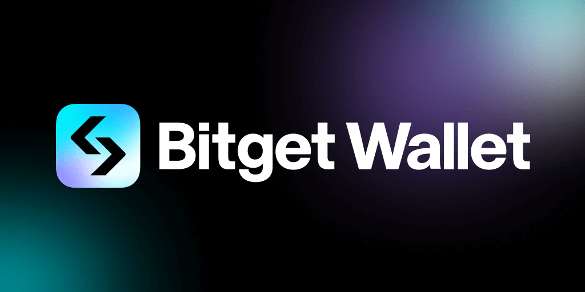

## Wallet

To interact with dApps on Morph, you need a compatible wallet. Below are some example wallets and configuration tips.

### Bitget Wallet

- Installation: Bitget Wallet can be installed from their [official website](https://web3.bitget.com/en/wallet-download).
- Importing Configurations: 

1. To add Morph mainnet within Bitget Wallet, go to *Wallet* tab
2. Click on the mainnet dropdown, and select *Add Mainnet*. 
3. Search for Morph in the list and select it (to add testnet, select *Morph Holesky*).

### MetaMask

- Installation: MetaMask can be installed from their [official website](https://metamask.io/download/).
- Importing Configurations: To set up MetaMask for Morph, click the "add to wallet" button on the [Morph Holesky block explorer page](https://explorer.morphl2.io/). This will automatically import the chain ID and RPC URLs for the Morph Mainnet & Testnet.
- Using Ethereum Holesky Testnet: Morph Testnet utilizes the Ethereum Holesky testnet as its underlying L1, which is already configured in MetaMask by default. To access it, enable "Show/hide test networks" in the MetaMask network selection dropdown.

### Manual network configuration

Currently, the Add to wallet links may not be compatible with all wallets yet. If you are having issues using them, you may need to manually add the Morph Mainnet & Testnet by inserting the configuration details from the table below:

#### Network Configuration

| Name                      | RPC Url(s)                            | Chain ID | Block explorer             | Symbol |
| -------- | -------------------------- | ------------- | ---------- | ------------------------------------ |
| Morph Mainnet            | https://rpc-quicknode.morphl2.io       | 2818   | https://explorer.morphl2.io      | ETH      |
| Ethereum Mainnet            | https://ethereum-rpc.publicnode.com/       | 1   | https://etherscan.io      | ETH      |
| Morph Holesky Testnet             | https://rpc-quicknode-holesky.morphl2.io       | 2810    | https://explorer-holesky.morphl2.io      | ETH      |
| Ethereum Holesky            | https://ethereum-holesky-rpc.publicnode.com/       | 17000    | https://holesky.etherscan.io      | ETH      |

You can also visit [chainlist](https://chainlist.org/?chain=11155111&search=morph&testnets=true) to add Morph.