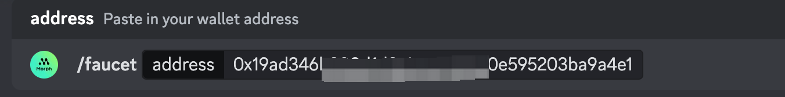
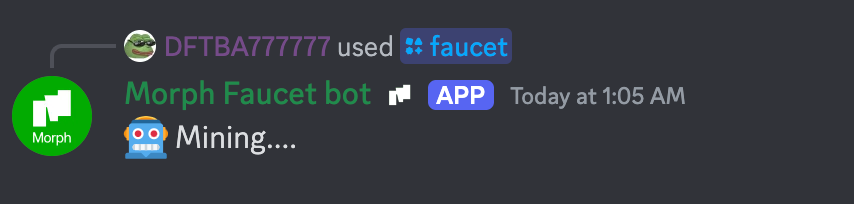

## Faucet

### Sepolia ETH Faucet

To use Morph's public testnet, obtain testnet ETH on Sepolia, then bridge it to the Morph testnet.

Here are a few Sepolia faucet apps:

https://sepoliafaucet.com/

https://www.infura.io/faucet/sepolia

https://faucet.quicknode.com/ethereum/sepolia

Once you receive ETH on Sepolia, you should see it in your wallet on the Sepolia Network. 

It may take a few seconds for them to appear, but you can check the status by looking for a transaction to your address on the [Sepolia Block Explorer](https://sepolia.etherscan.io/).

### Morph ERC20 Faucet

:::tip

Currently, we set the limit that for each discord user, you can only request the tokens once every 24 hours.

:::

You can obtain morph's version of USDT on Sepolia through our discord faucet, here's how it works:

1. Join our discord server through this [link](https://discord.gg/f3Wh6ZK6XC)

2. Find the *#| discord-faucet* channel

3. type */faucet* in the channel and add your Sepolia address behind it.

4. Wait for a few seconds.

5. Once succeeded, you will see this in the channel.

6.  Add the Morph Sepolia USDT information to your wallet

~~~

Sepolia address: "0x5F4c7D793D898e64eddd1fC82D27EcfB5F6e4596"

Morph Sepolia address: "0xB4A71512cf4F3A8f675D2aeC76198D6419D219C7"

~~~

7. Check you wallet for USDT balance and start to bridge!