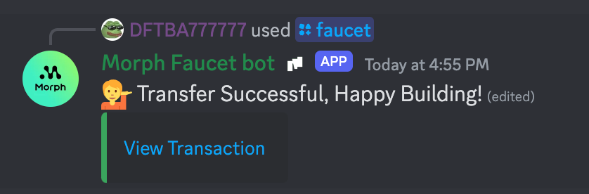

## Faucet

### Morph Holesky Website Faucet

Our [website faucet](https://morphfaucet.com/) is live! 

Users can claim Morph ETH & USDT to fund their initial activities.

### 3rd Party Ethereum Holesky ETH Faucet

To use Morph's public testnet, obtain testnet ETH on Holesky, then bridge it to the Morph testnet.

Here are a few Holesky faucet apps:

https://stakely.io/en/faucet/ethereum-holesky-testnet-eth

https://faucet.quicknode.com/ethereum/holesky

https://holesky-faucet.pk910.de/

https://cloud.google.com/application/web3/faucet/ethereum (needs a Google account)

Once you receive ETH on Holesky, you should see it in your wallet on the Holesky Network. 

It may take a few seconds for them to appear, but you can check the status by looking for a transaction to your address on the [Holesky Block Explorer](https://holesky.etherscan.io/).

### Discord Morph Holesky Faucet

### Morph Holesky ETH

You can obtain the Morph Holesky ETH in our discord too for development purposes.

Using the */morph_eth* command and type your address will grant you 0.01 Morph Holesky ETH.

Once succeed, you will see the following message:

### ERC20 USDT

:::tip

Currently, we set the limit that for each discord user, you can only request the tokens once every 24 hours.

:::

You can obtain morph's version of USDT on Holesky through our discord faucet, here's how it works:

1. Join our discord server through this [link](https://discord.com/invite/L2Morph).

2. Find the *#| discord-faucet* channel.

3. Type */faucet* in the channel and add your Holesky address behind it.

4. Wait for a few seconds.

5. Once succeeded, you will see this in the channel.

6.  Add the Morph Holesky USDT information to your wallet.

~~~

Ethereum Holesky USDT address: "0xD6e9Cd5ef382b0830653d1b2007D5Ca6987FaA26"

Morph Holesky USDT address: "0x9E12AD42c4E4d2acFBADE01a96446e48e6764B98"

~~~

7. Check you wallet for USDT balance and start to bridge!

