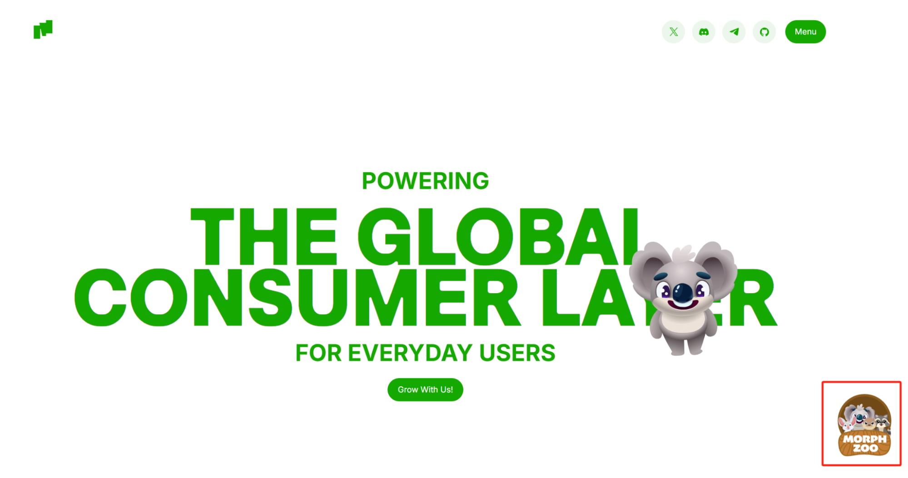
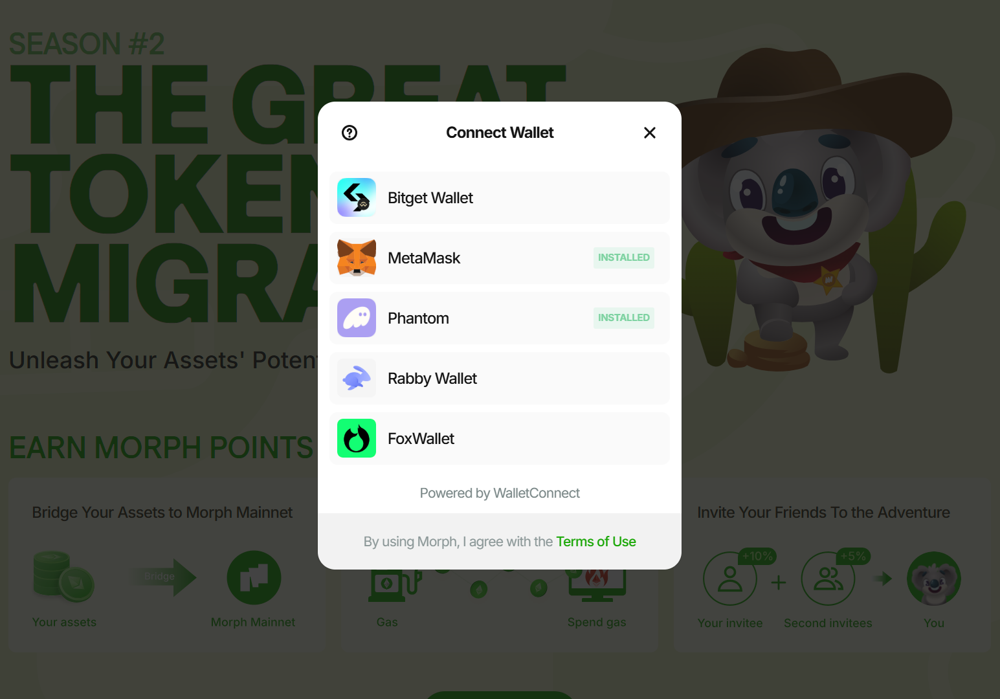
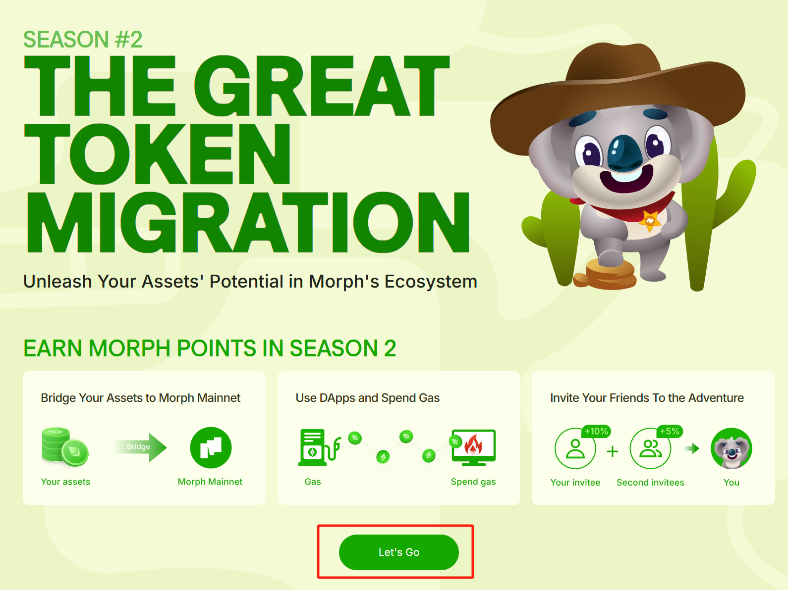
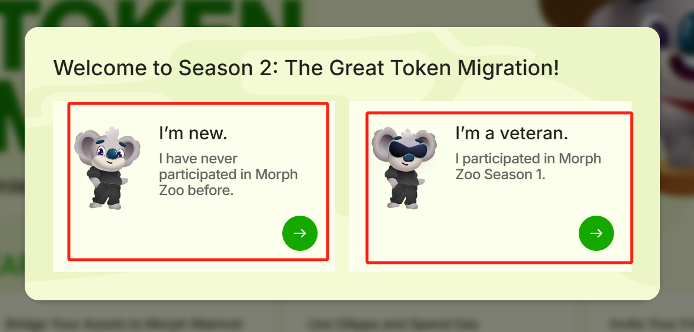
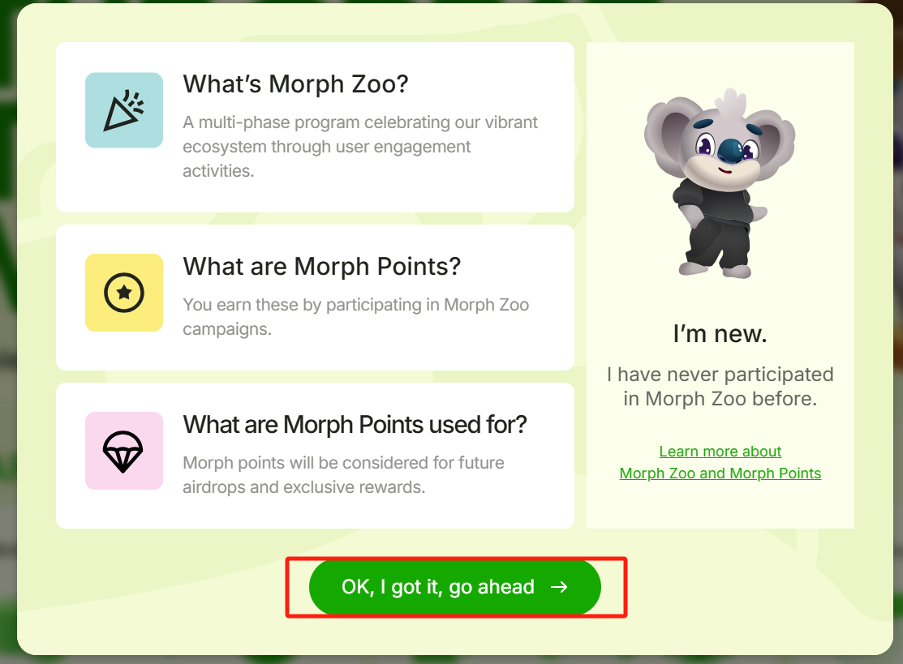
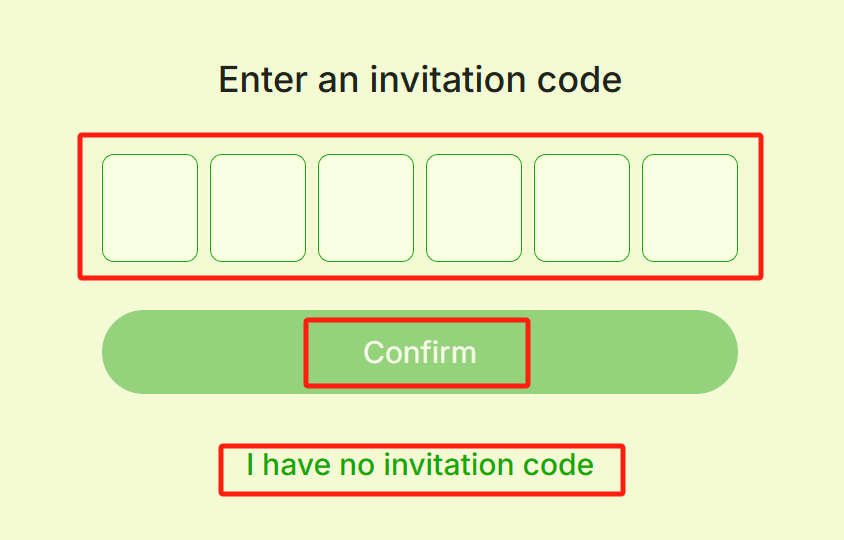
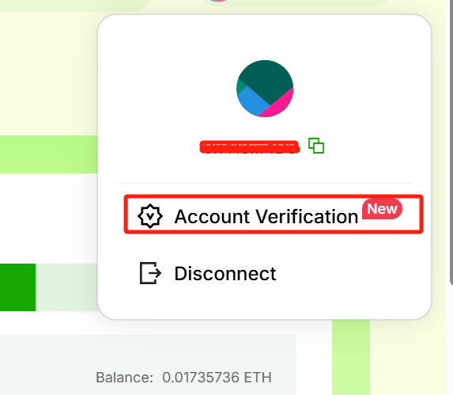
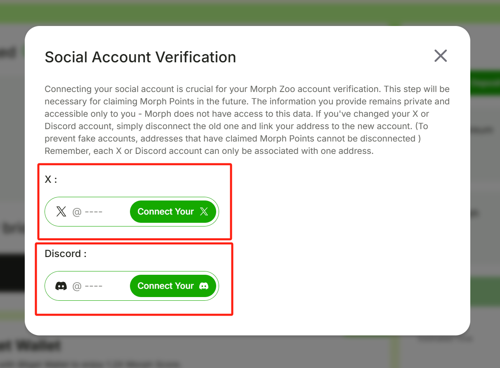
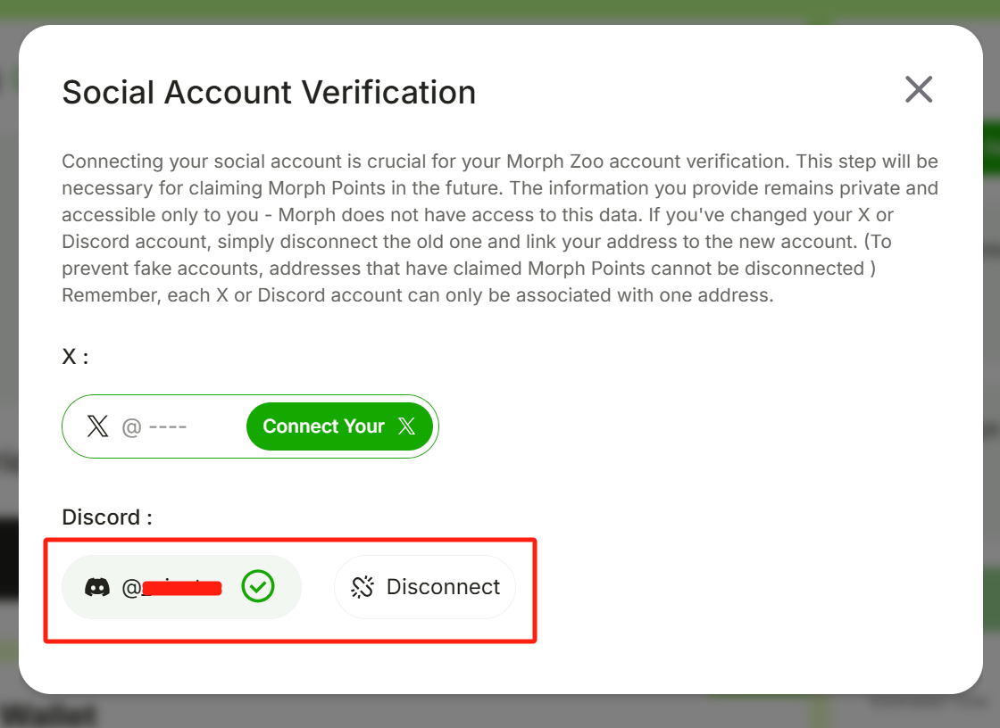

1. Visit https://www.morphl2.io/

2. Click the __Morph Zoo__ icon on the lower right corner of the page. 

3. Within the __Season 2__ section click the __Let’s Go__ button

4. Select your preferred wallet, log in, and accept the pop-up prompts to connect your wallet to Morph. 

5. Click the __Let’s Go__ button at the bottom of the page.  

6. Select whether you’re a new user or have participated in Morph Zoo Season 1. For this guide, we will assume you’re a new user. 

7. Read the introductory points and click __OK, I got it, go ahead__ to continue. 

8. Enter an __Invitation Code__ and click __Confirm__ if you have one, or click I __have no invitation code__ if you don't.  

9. Once you return to the main Season 2 page, click on your wallet address in the top right corner. 

10. Within the drop-down menu, click on __Account Verification__
 
11. Select your preferred verification option. 

12. A new pop-up window will prompt you to enter your login information and authorize, or authorize based on whatever login information is saved in your browser.
Once authorized, you will have a checkmark next to your selected method and the option to disconnect when needed.  

13. Now that your wallet is connected and your account is verified, learn [how to bridge ETH to Morph](3-how-to-brigde-eth.md) next. 