1. Visit https://www.morphl2.io/
2. Click the __Morph Zoo__ icon on the lower right corner of the page. 

3. Within the __Season 2__ section click the __Let’s Go__ button

4. Select your preferred wallet, log in, and follow the accept the pop-up prompts to connect your wallet to Morph. 

5. Click the __Bridge__ option from the left-side navigation menu.  
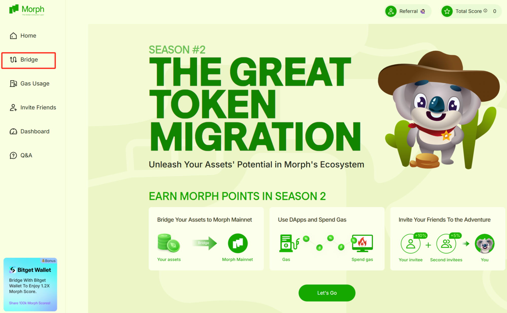
6. Tick the checkbox to agree to the __Terms of Service__ and click __Let’s go__
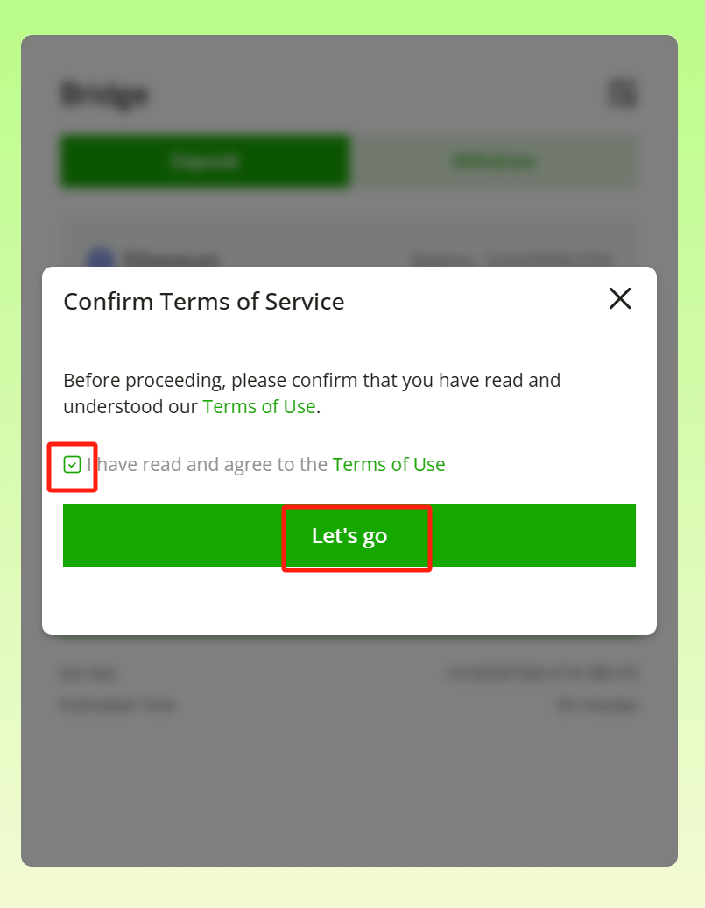

7. Within the __Bridge__ module, make sure you are on the __Deposit__ tab, have __ETH__ selected as the token to transfer, and enter the amount of ETH you wish to bridge onto Morph. 
8. Click the __Send ETH to Morph__ button when ready.  
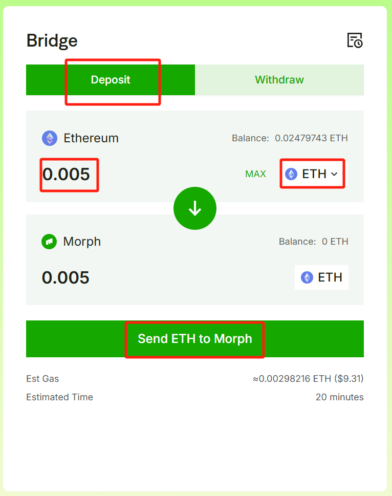
9. Review the confirmation screen and click __Deposit__ when ready.
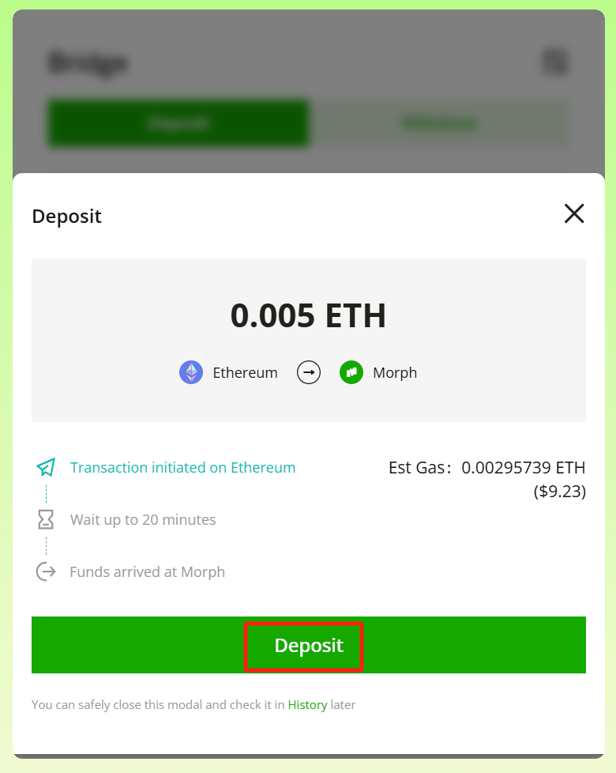
10. __Confirm__ the transaction through your wallet’s pop-up notifications. 
11. Once successfully confirmed, the screen will update with a __Waiting__ message and your estimated completion time.
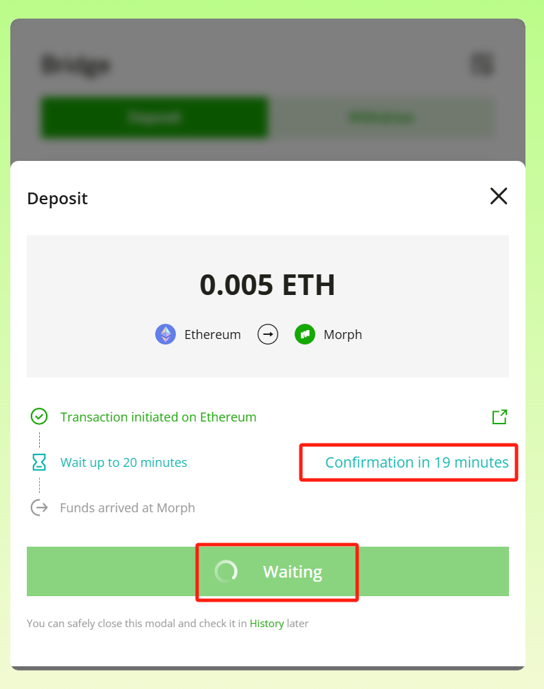
12. When complete, you’ll receive a __“Transaction successful!”__ message. 
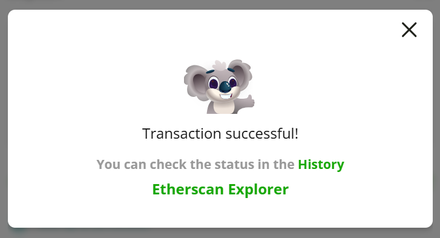

### Optional 

#### Check Transaction Records
1. Within the __Bridge__ module, click the __Transaction History__ icon on the top right corner.  
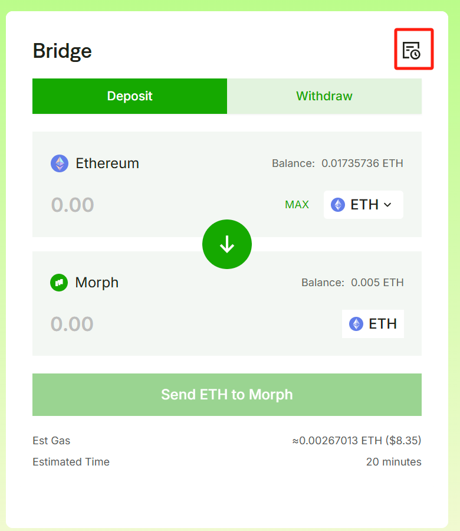
2. Click the __Check__ button next to any recorded transaction. 
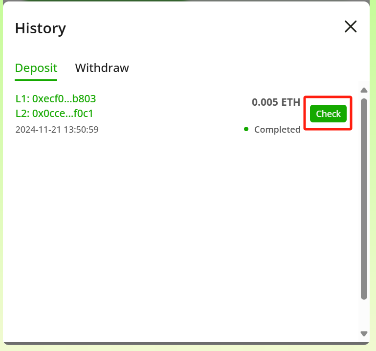
3. Here you have the option to review the transaction on both the Ethereum and Morph explorers by clicking either of the __External Link__ icons.
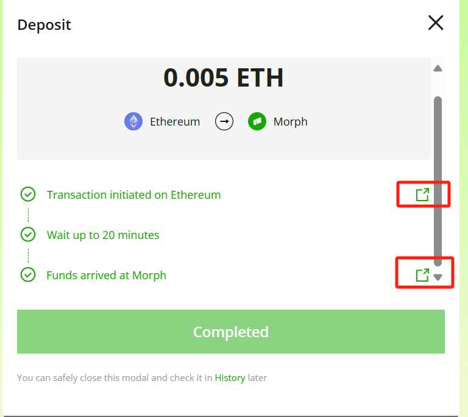

#### Add Morph Mainnet to Wallet
Another way to verify your assets have been successfully bridged to Morph is by looking at your balance within your wallet. You must first add the Morph Mainnet network to your wallet and then make sure it’s selected. Below is the quickest way to add Morph Mainnet using MetaMask as the example wallet.
1. Within the __Bridge__ page, click the __Add Morph Mainnet__ button.  
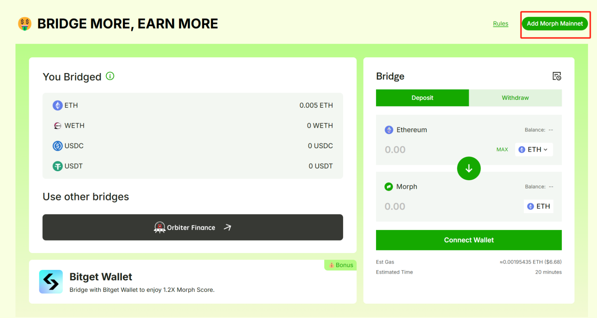
2. A MetaMask pop-up will immediately prompt you to approve the addition of the Morph Mainnet network. Click __Approve__. 

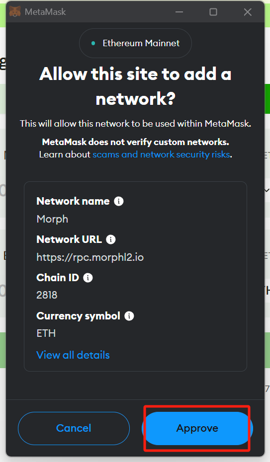

3. Next, click __Switch Network__ and now you can view all of your assets on Morph through your wallet or the __Season 2 Bridge__ page.   
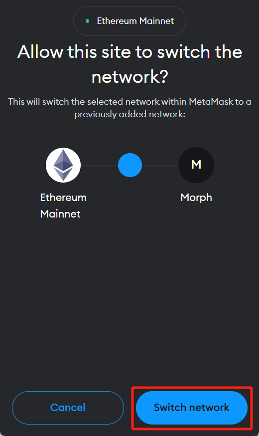

4. With ETH now available on Morph, learn [how to explore our ecosystem DApps](4-how-to-explorer-ecosystem-dapps.md) to spend gas and earn Morph Points next. 

