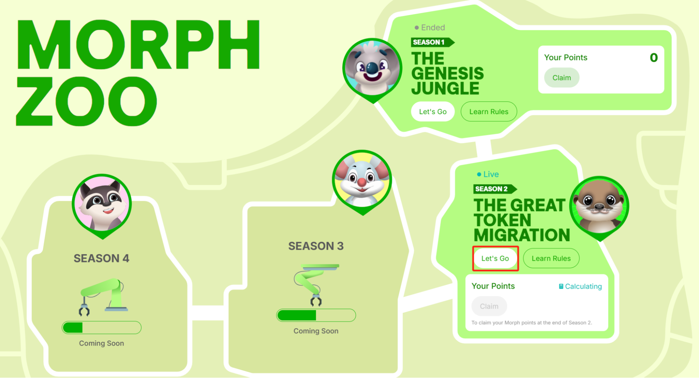
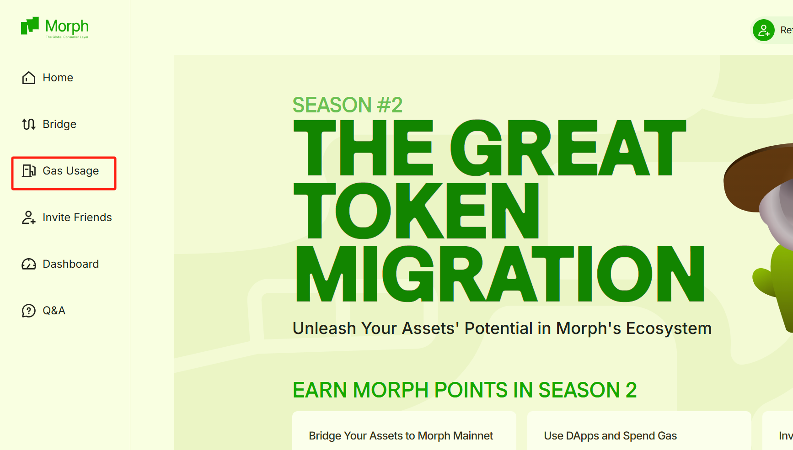
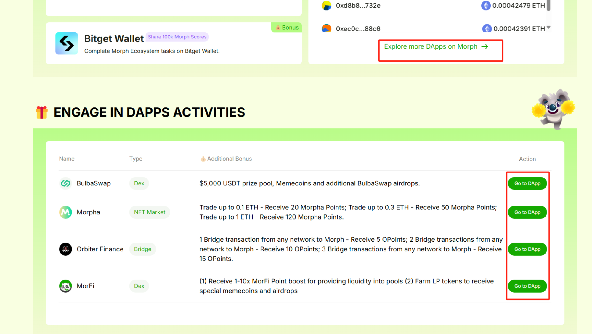

Please make sure you’ve followed our previous guides and have some ETH available on Morph.

1. Visit https://www.morphl2.io/
2. Click the __Morph Zoo__ icon on the lower right corner of the page. 

3. Within the __Season 2__ section click the __Let’s Go__ button

4. Select your preferred wallet, log in, and follow the accept the pop-up prompts to connect your wallet to Morph. 

5. Click the __Gas Usage__ option from the left-side navigation menu.  

6. Click the __Explore more DApps__ on Morph option to navigate to our __Ecosystem__ page to search for dapps by keywords or categories or try some of the highlight DApps currently offering additional prizes and points. 

7. Clicking on any DApp link will take you to an external website. Make sure you review any instructions our partner DApps may have, connect your wallet, select Morph Mainnet, and begin approving transactions to earn as many Morph Points as possible. 

To earn even more Morph Points, learn [how to invite your friends](5-how-to-invite-friends.md) to participate in Season 2 next. 
