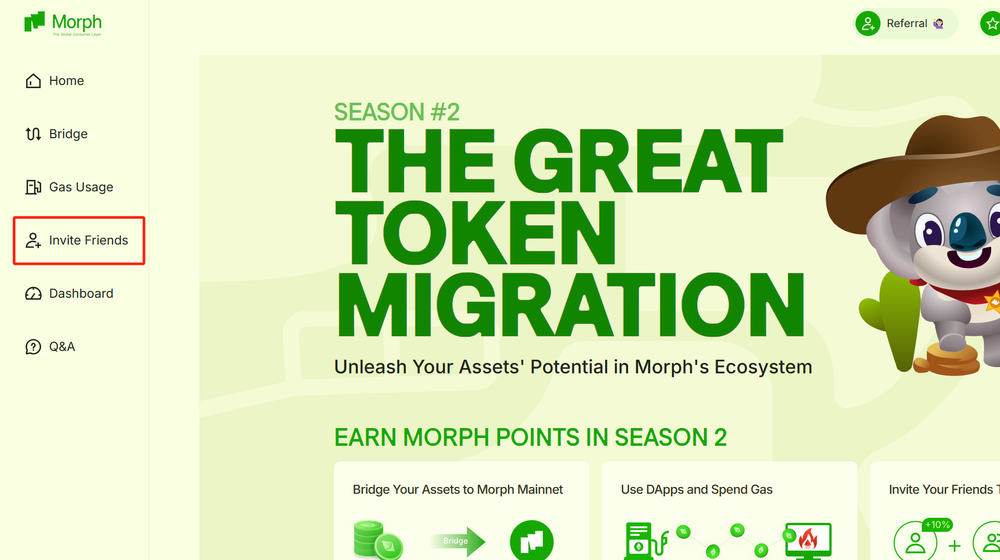
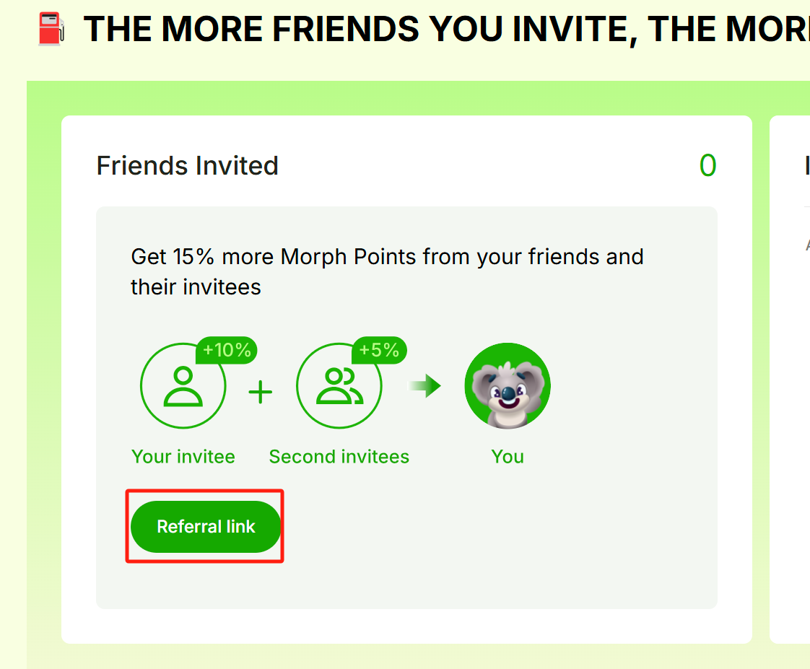

1. Visit https://www.morphl2.io/
2. Click the __Morph Zoo__ icon on the lower right corner of the page. 

3. Within the __Season 2__ section click the __Let’s Go__ button

4. Select your preferred wallet, log in, and follow the accept the pop-up prompts to connect your wallet to Morph. 

5. Click the __Invite Friends__ option from the left-side navigation menu.  

6. Click the __Referral link__ button.

7. The pop-up window will display and allow you to quickly copy your referral code to share with friends or click the __Copy Referral Link__ button to share a direct link to Season 2 with your referral code automatically added. 

