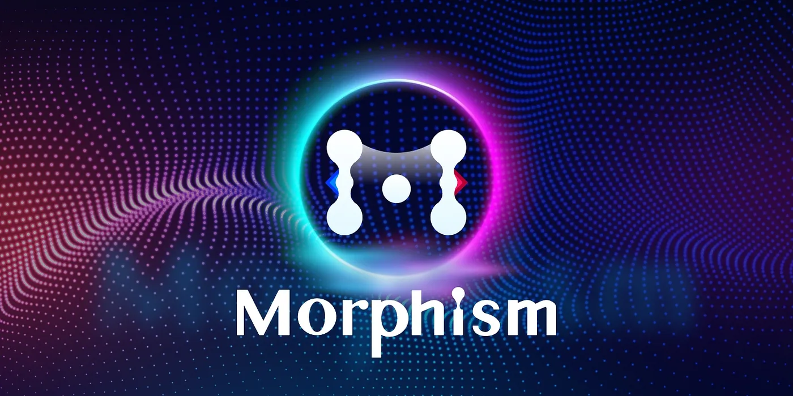

## Overview

Welcome to the Morphism Documentation.

Morphism is the first Optimistic zkEVM scaling solution that utilized responvise validity proof (RVP) to address the blockchain trillema.

Rollup technology has long been divided into two categories based on the state verification mechanism used, namely [Optimistic Rollup](https://ethereum.org/en/developers/docs/scaling/optimistic-rollups/) (using Fraud Proof) and [ZK Rollup](https://ethereum.org/en/developers/docs/scaling/zk-rollups/) (using Validity Proof). 

Morphism has achieved a balance and harmony between the two by using Validity Proof to verify the Layer2 state and building on the foundation of Optimistic Rollup. This innovation enables Morphism to combine the advantages of the two Rollup technologies and become one of the best solutions for Ethereum's scalability at present.

The documentation will presents details on:
- What is Morphism and its Architecture
- Our Protocol Design to approach best Ethereum Scalability
- What roles can you play in the Morphism system and their importance
- How to seemlessly develop/deploy Ethereum dapps on Morphism

## What makes Morphism different

- The idea of [Responsive validity proof](https://medium.com/@Morphism_EN/responsive-validity-proof-optimistic-zk-rollup-7838fe87dbcc) 
- Decentralized Sequencer Setup from Beginning
- Top-notch Scalability
- Seamless Ethereum Development Experience

Morphism is the first Optimistic ZK-Rollup which harnesses the benefits of both Op-Rollup and ZK-Rollup. 

Based on Morphism's native decentralized sequencer design, it can achieve a higher level of security than existing centralized Layer 2 solutions. 

Finally, developers and users on Morphism can use the same code, tooling, apps, etc that they use on Ethereum, but with much higher throughput and lower fees. Morphism offers compatibility and scalability without compromise.